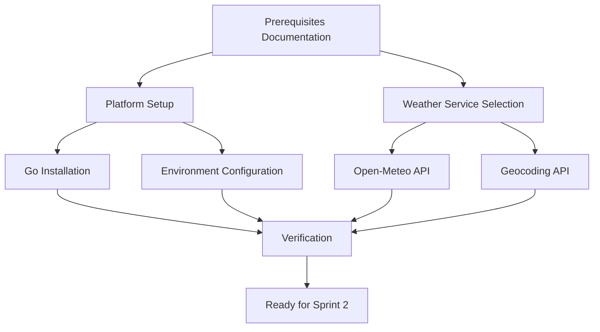

# Sprint 1 - Design

## RSB-1. Prepare tools and techniques

Status: Proposed

### Requirement Summary

Document prerequisites for developing the weather forecast application using Go on macOS (OSX) only. Select an appropriate public weather service API that will be used throughout the project. Create guided, copy-paste-able documentation for system setup at MVP-level simplicity.

**Scope Change:** Focus exclusively on macOS platform per Product Owner direction.

### Feasibility Analysis

**API Availability:**

Since this Sprint focuses on documentation and service selection (no code implementation), API feasibility relates to weather service availability. Multiple suitable public weather APIs exist with free tiers:

1. **OpenWeatherMap API** - https://openweathermap.org/api
   - Free tier: 60 calls/minute, 1,000,000 calls/month
   - Supports city name and GPS coordinates
   - 3-day forecast available (5-day in free tier)
   - JSON response format
   - Well-documented, widely used
   - Requires API key

2. **WeatherAPI.com** - https://www.weatherapi.com/
   - Free tier: 1,000,000 calls/month
   - Supports city name and GPS coordinates
   - 3-day forecast in free tier
   - JSON response format
   - Good documentation
   - Requires API key

3. **Open-Meteo** - https://open-meteo.com/
   - Completely free, no API key required
   - Supports GPS coordinates (not city names directly)
   - 16-day forecast available
   - JSON response format
   - Good documentation
   - No rate limits for non-commercial use

4. **WeatherStack** - https://weatherstack.com/
   - Free tier: 1,000 requests/month (limited)
   - Supports city name and GPS coordinates
   - Current weather only in free tier (no forecast)
   - Not suitable for 3-day forecast requirement

**Go Language Availability:**

Go installation is well-supported across all target platforms via official installers and package managers.

**Technical Constraints:**

- Documentation only (no code implementation in this Sprint)
- Focus on macOS (OSX) only - Linux and Windows deferred
- Weather API must support both city name and GPS coordinate queries (required for future Sprints)
- Free tier must be sufficient for demo/development usage
- API must provide 3-day forecast minimum (required by RSB-2)

**Risk Assessment:**

- **Weather API Selection Risk**: Medium
  - Chosen API may change pricing or terms
  - Free tier limits may be restrictive
  - Mitigation: Select established API with generous free tier, document alternative options

- **Platform Documentation Risk**: Low
  - macOS versions may vary from documented version
  - Homebrew commands may change
  - Mitigation: Document tested macOS version, provide general guidance for adaptation

- **API Key Management Risk**: Medium
  - Users must manage API keys securely
  - Keys should not be hardcoded
  - Mitigation: Document environment variable approach, emphasize security best practices

### Design Overview

**Architecture:**

This Sprint produces documentation artifacts, not code. The "architecture" is the documentation structure:

```
Prerequisites Documentation (macOS only)
├── macOS Platform Setup
│   ├── Go Installation (Homebrew)
│   ├── Environment Configuration
│   └── Verification Steps
├── Weather Service Selection
│   ├── Service Comparison
│   ├── API Testing (no key required)
│   └── API Endpoint Documentation
└── Quick Start Verification
    └── End-to-End Setup Test
```

**Key Components:**

1. **macOS Installation Guide**
   - Purpose: Provide macOS-specific Go setup instructions via Homebrew
   - Responsibilities: Document installation commands, PATH setup, verification

2. **Weather Service Documentation**
   - Purpose: Document selected API and setup process
   - Responsibilities: API comparison, endpoint documentation, basic testing

3. **Verification Checklist**
   - Purpose: Allow users to confirm successful setup on macOS
   - Responsibilities: List all verification commands and expected outputs

**Data Flow:**

N/A - Documentation Sprint (no code/data flow)

### Technical Specification

**Weather Service Selection: Open-Meteo (Recommended)**

**Selection Rationale:**

After analyzing available options, **Open-Meteo** is recommended for this project:

**Advantages:**
- ✅ No API key required (simpler setup for MVP)
- ✅ Generous free tier with no rate limits for non-commercial use
- ✅ 16-day forecast (exceeds 3-day requirement)
- ✅ Well-documented JSON API
- ✅ Supports GPS coordinates (required for map features in RSB-6, RSB-7)
- ✅ Active development and maintenance
- ✅ European-based service with GDPR compliance

**Disadvantages:**
- ⚠️ Does not directly support city name queries (requires geocoding)
- ⚠️ Requires separate geocoding service for city name → coordinates

**Mitigation for City Name Support:**

Use **Open-Meteo Geocoding API** (also free, no key required):
- Endpoint: `https://geocoding-api.open-meteo.com/v1/search`
- Converts city names to GPS coordinates
- Returns multiple matches for disambiguation (useful for RSB-6)
- Same provider, consistent free tier

**Alternative: OpenWeatherMap (Fallback Option)**

If Open-Meteo proves insufficient, OpenWeatherMap is documented as alternative:
- More widely known
- Requires API key (additional setup step)
- Generous free tier
- Supports both city names and GPS coordinates natively

**Documentation Structure:**

```markdown
# Prerequisites - Weather Forecast Application (macOS)

## Overview
[Brief project introduction]
[Note: This guide focuses on macOS only]

## macOS Requirements

### System Requirements
- macOS 11.0 (Big Sur) or later
- Homebrew package manager
- Internet connectivity

### Go Installation (Homebrew)

#### Install Homebrew (if not already installed)
[Copy-paste-able command]

#### Install Go
[Copy-paste-able commands using Homebrew]

#### Environment Configuration
[PATH setup if needed - Homebrew usually handles this]
[GOPATH configuration]

#### Verification
[Commands to verify installation: go version, go env]

## Weather Service Setup

### Selected Service: Open-Meteo

#### Why Open-Meteo?
[Comparison table and rationale]

#### API Endpoints

**Weather Forecast:**
- Endpoint: `https://api.open-meteo.com/v1/forecast`
- Parameters: latitude, longitude, daily parameters
- Example: [Copy-paste-able curl command]

**Geocoding (City Name → Coordinates):**
- Endpoint: `https://geocoding-api.open-meteo.com/v1/search`
- Parameters: name, count, language
- Example: [Copy-paste-able curl command]

#### Testing the API
[Copy-paste-able test sequences]

### Alternative: OpenWeatherMap (Optional)

[Documentation for fallback option]

## Verification Checklist

- [ ] Go installed and version confirmed
- [ ] GOPATH configured correctly
- [ ] Weather API accessible via curl
- [ ] Geocoding API accessible via curl
- [ ] Ready to proceed to Sprint 2

## Troubleshooting

### Common Issues

#### Issue 1: Go not found in PATH
[Solution]

#### Issue 2: API request timeout
[Solution]

## Next Steps

Once prerequisites are complete, proceed to Sprint 2 (CLI implementation).
```

**Scripts/Tools:**

No scripts created in this Sprint (documentation only).

**Error Handling:**

N/A - Documentation Sprint (error handling will be addressed in implementation Sprints)

### Implementation Approach

**Step 1: Create Documentation Structure**
- Create prerequisites document in project root or docs/ directory
- Use Markdown format for easy reading and maintenance

**Step 2: Document Go Installation (macOS only)**
- Research current Go version (as of 2025-11-13)
- Document macOS installation using Homebrew:
  - Homebrew installation (if needed)
  - Go installation via `brew install go`
  - Note: Homebrew handles PATH automatically
- Add verification commands (`go version`, `go env`)
- Document GOPATH configuration if needed

**Step 3: Weather Service Documentation**
- Create comparison table of candidate services
- Document Open-Meteo selection rationale
- Provide API endpoint documentation
- Create copy-paste-able curl test commands
- Document OpenWeatherMap as alternative option

**Step 4: Create Verification Checklist**
- List all setup steps with checkboxes
- Provide verification commands
- Include expected outputs

**Step 5: Add Troubleshooting Section**
- Document common setup issues
- Provide solutions for typical problems

### Testing Strategy

**Functional Tests:**

Since this is a documentation Sprint, testing involves verification that documentation is accurate and usable:

1. **Copy-Paste Test**: Verify all command sequences can be copied and executed without modification
2. **macOS Platform Test**: Verify commands work on macOS (test on macOS 11.0+)
3. **API Connectivity Test**: Verify weather API endpoints are accessible
4. **Completeness Test**: Ensure all macOS prerequisites are documented

**Edge Cases:**

1. **Homebrew Not Installed**: Document Homebrew installation first
2. **Proxy/Firewall**: Note that API access requires internet connectivity
3. **Older macOS Versions**: Document tested version (macOS 11.0+), note compatibility

**Success Criteria:**

- ✅ Documentation exists for macOS platform
- ✅ Go installation commands are copy-paste-able (Homebrew)
- ✅ Weather service selected and documented
- ✅ API endpoints tested and confirmed working
- ✅ Verification checklist provided
- ✅ All examples use proper formatting (no `exit` commands)
- ✅ Prerequisites clearly stated for macOS

### Integration Notes

**Dependencies:**

- None (Sprint 1 is foundational)

**Compatibility:**

Forward compatibility considerations:
- Weather API must support GPS coordinates (required for RSB-6 map integration)
- Geocoding API needed for city name support (RSB-2)
- API response format should be JSON for easy Go parsing (RSB-2, RSB-4)

**Reusability:**

Documentation will be referenced by:
- Sprint 2 (CLI implementation) - uses selected API
- Sprint 3 (REST API) - exposes same weather data
- Sprint 4-6 (WebUI and map features) - requires GPS coordinate support

### Documentation Requirements

**User Documentation:**

The entire Sprint output IS user documentation:
- Prerequisites document in Markdown
- Platform-specific installation guides
- Weather service setup instructions
- Verification procedures
- Troubleshooting guide

**Technical Documentation:**

- Weather API endpoint specifications
- Geocoding API endpoint specifications
- Expected JSON response formats (examples)
- API comparison table with selection rationale

### Design Decisions

**Decision 1: Open-Meteo as Primary Weather Service**

**Rationale:**
- No API key required simplifies MVP setup
- Generous free tier supports development and demo usage
- 16-day forecast exceeds requirements
- GPS coordinate support required for future map features
- Geocoding API available from same provider

**Alternatives Considered:**
- OpenWeatherMap: More widely known but requires API key
- WeatherAPI.com: Good free tier but adds complexity
- WeatherStack: Insufficient free tier (no forecast)

**Decision 2: Separate Geocoding Service**

**Rationale:**
- City name support required by RSB-2
- Open-Meteo forecast API only accepts GPS coordinates
- Open-Meteo provides free geocoding API
- Separation allows for city disambiguation (helpful for RSB-6)

**Alternatives Considered:**
- Hardcoded city coordinate database: Not scalable
- Different weather service: Would require API key

**Decision 3: Documentation Location**

**Rationale:**
- Create `docs/prerequisites.md` in project
- Keeps prerequisites separate from code
- Easy to reference and update
- Markdown format for GitHub rendering

**Alternatives Considered:**
- README.md: Would make README too long
- Wiki: Less integrated with codebase

**Decision 4: Go Version**

**Rationale:**
- Document current stable version (Go 1.21+ as of late 2024/early 2025)
- Go has strong backward compatibility
- Recommend latest stable for best features and security

**Alternatives Considered:**
- Specify exact version: Too restrictive
- No version guidance: Could cause compatibility issues

### Open Design Questions

**None**

All design decisions are clear for this documentation-focused Sprint. The selected weather service (Open-Meteo) meets all requirements and provides a path forward for future Sprints.

---

# Design Summary

## Overall Architecture

Sprint 1 establishes the foundational prerequisites through documentation:



## Shared Components

**Weather Service APIs (for future Sprints):**
- Open-Meteo Forecast API: Used by CLI (Sprint 2), REST API (Sprint 3), WebUI (Sprint 4-6)
- Open-Meteo Geocoding API: Used for city name resolution across all components

## Design Risks

| Risk | Severity | Mitigation |
|------|----------|------------|
| API service changes or discontinuation | Medium | Document alternative (OpenWeatherMap), design for easy switching |
| Free tier proves insufficient | Low | Monitor usage, document rate limits, have fallback ready |
| macOS version variations | Low | Test on recent macOS, document tested version (11.0+) |
| Homebrew command changes | Low | Document current commands, note Homebrew updates handle compatibility |
| Geocoding inaccuracy for ambiguous cities | Low | Document disambiguation approach (useful for RSB-6) |

## Resource Requirements

**Tools:**
- Go language compiler (latest stable version: 1.21+)
- curl or similar HTTP client for API testing
- Text editor for documentation

**External Services:**
- Open-Meteo Forecast API (free, no key required)
- Open-Meteo Geocoding API (free, no key required)
- Alternative: OpenWeatherMap API (free tier with API key)

**Documentation Tools:**
- Markdown editor
- GitHub for rendering and version control

## Design Approval Status

**Status: Proposed**

Design is complete and ready for Product Owner review. Awaiting approval to proceed to Construction phase.

**Key Points for Review:**
1. **Scope: macOS only** per Product Owner direction
2. Open-Meteo selected as weather service (no API key required)
3. Separate geocoding API for city name support
4. Documentation-only Sprint (no code implementation)
5. Homebrew-based installation for simplicity
6. Copy-paste-able command sequences throughout
