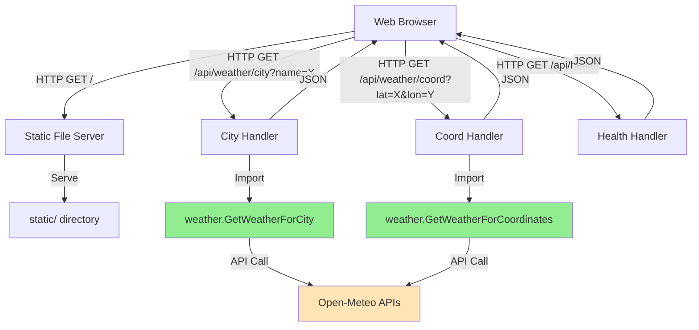
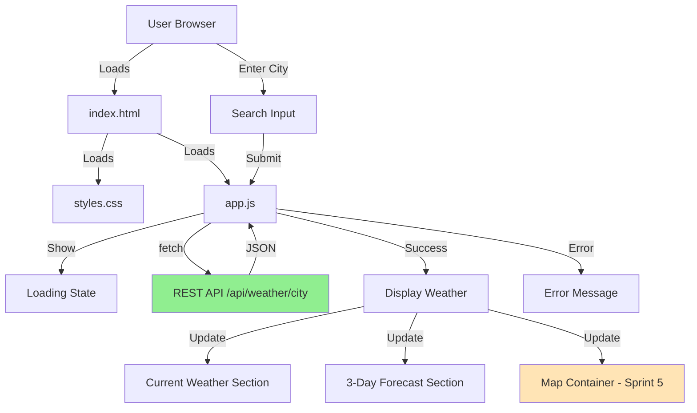
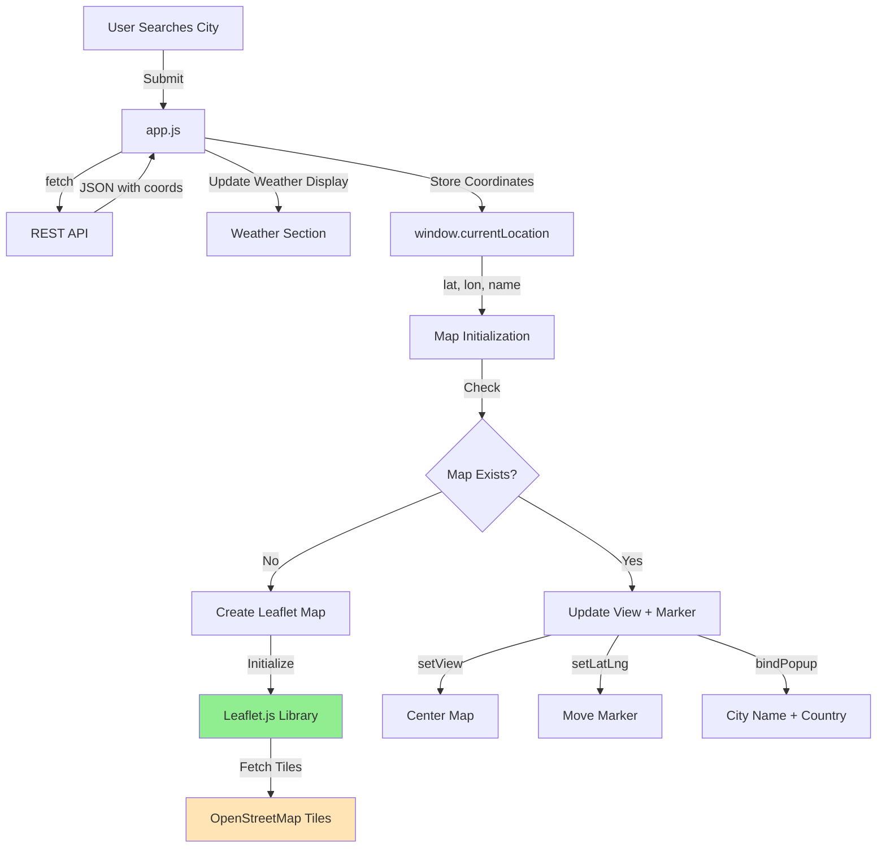

# Sprint 4 & 5 - Design

**Designer:** Claude (Designer Agent)
**Date:** 2025-12-07
**Phase:** Elaboration (Phase 3/5)
**Execution Mode:** YOLO (Autonomous)
**Status:** Proposed

---

## YOLO Mode Decisions

This sprint was designed in YOLO (autonomous) mode. The following design decisions were made:

### Decision 1: Vanilla JavaScript over React

**Context:** Frontend framework selection for WebUI implementation (RSB-5)

**Decision Made:** Use Vanilla JavaScript (ES6+) with no frontend framework

**Rationale:**
- **Project Goal Alignment:** PLAN.md and BACKLOG.md emphasize "MVP level" and "simplistic implementation"
- **Zero Dependencies:** No build tooling, npm packages, or bundlers required
- **Faster Development:** No framework learning curve, direct browser execution
- **Deployment Simplicity:** Static files can be served directly from Go HTTP server
- **Sufficient for Requirements:** Weather display + map integration doesn't require React's complexity
- **Forward Compatible:** Sprint 5 Leaflet.js works perfectly with Vanilla JS

**Alternatives Considered:**
- **React:** Better component structure, but adds significant complexity (npm, build process, JSX)
- **Vue.js:** Simpler than React, but still requires build tooling
- **Svelte:** Excellent for simplicity, but requires compiler

**Risk:** **Low** - Vanilla JS is well-established, no compatibility issues, direct browser support

---

### Decision 2: Emoji-Based Weather Icons

**Context:** Visual weather representation for WebUI

**Decision Made:** Use emoji characters (☀️ ☁️ 🌧️ ❄️ ⛈️) for weather condition icons

**Rationale:**
- **Zero Dependencies:** No icon library, no image files, no CDN
- **Cross-Platform:** Unicode emoji work on all modern browsers
- **Immediate Availability:** No asset management or download needed
- **MVP Appropriate:** Simple visual representation sufficient for weather codes
- **Lightweight:** No bandwidth overhead
- **Accessible:** Screen readers can interpret emoji

**Alternatives Considered:**
- **SVG Icons:** Requires icon library or manual SVG creation
- **PNG/JPG Images:** Requires asset hosting and management
- **Icon Font (Font Awesome):** External dependency, adds weight
- **Weather Icons Library:** Overkill for MVP, adds dependency

**Risk:** **Low** - Emoji rendering is consistent across modern browsers

---

### Decision 3: Monorepo File Structure with weather-api Directory

**Context:** Project organization for REST API implementation

**Decision Made:** Create `weather-api/` directory at project root, following existing `weather-cli/` pattern

**Rationale:**
- **Consistency:** Matches established project structure (weather-cli/, progress/, rules/)
- **Separation of Concerns:** Each tier in separate directory
- **Import Path Clarity:** `import "weather-cli/weather"` remains clean
- **BACKLOG.md Alignment:** "The product is kept in ./weather-api following ./weather-cli approach"
- **Deployment Independence:** Each service can be deployed separately if needed

**Alternatives Considered:**
- **Nested Structure:** `weather-cli/api/` - breaks separation, couples tiers
- **Combined Binary:** Single main.go with CLI + API - violates separation principle
- **Separate Repositories:** Overkill for MVP, complicates imports

**Risk:** **Low** - Standard Go project organization pattern

---

### Decision 4: Single HTTP Server for API + Static Files

**Context:** Whether to run separate servers for REST API and WebUI

**Decision Made:** Single Go HTTP server serves both REST API endpoints AND static HTML/JS/CSS files

**Rationale:**
- **CORS Avoidance:** Same origin policy eliminates cross-origin issues
- **Deployment Simplicity:** One process, one port, simpler operations
- **Go Best Practice:** Standard pattern with `http.FileServer` for static content
- **MVP Alignment:** Minimal infrastructure complexity
- **Resource Efficiency:** Single process consumes fewer resources

**Alternatives Considered:**
- **Separate Servers:** API on :8080, WebUI on :3000 - requires CORS configuration
- **Reverse Proxy:** Nginx/Apache frontend - adds infrastructure complexity
- **External Static Hosting:** S3/CDN - overkill for MVP

**Risk:** **Low** - Well-established Go web server pattern

---

### Decision 5: Port 8080 for HTTP Server

**Context:** Port selection for weather API + WebUI server

**Decision Made:** Listen on port 8080

**Rationale:**
- **Standard Development Port:** Commonly used for HTTP services (not 80 which requires root)
- **Non-Privileged:** Doesn't require root/administrator permissions
- **Avoids Conflicts:** Port 80/443 often occupied by system services
- **Developer Familiarity:** Well-known convention
- **Configurable:** Can be changed via environment variable if needed

**Alternatives Considered:**
- **Port 80:** Requires root privileges on Unix systems
- **Port 3000:** Common for Node.js, but 8080 more standard for Go
- **Random High Port:** Less discoverable, not conventional

**Risk:** **Low** - Standard port choice

---

### Decision 6: Graceful Error Handling with User-Friendly Messages

**Context:** Error presentation strategy for WebUI

**Decision Made:** Convert technical API errors to user-friendly messages in frontend

**Rationale:**
- **User Experience:** Non-technical users don't need stack traces
- **Progressive Enhancement:** Show loading states, then data or error
- **Helpful Guidance:** "City not found - try 'London, UK'" vs "404 Not Found"
- **Accessibility:** Clear error messages help all users

**Error Mapping Strategy:**
```javascript
- Network errors → "Unable to connect. Please check your internet connection."
- 404 city not found → "City not found. Try being more specific (e.g., 'Paris, France')"
- 500 server errors → "Weather service temporarily unavailable. Please try again."
- Invalid input → "Please enter a valid city name or coordinates (lat,lon)"
```

**Alternatives Considered:**
- **Raw API Errors:** Technical but not user-friendly
- **Generic "Error Occurred":** Not helpful for user action
- **No Error Handling:** Poor user experience

**Risk:** **Low** - Standard UX best practice

---

## RSB-4. Weather Forecast REST API (Sprint 4 Part A - Prerequisite)

Status: Proposed

### Requirement Summary

Implement RESTful API that exposes weather forecast data through HTTP endpoints. This was originally Sprint 3 (RSB-4) but was never implemented despite being marked "Done" in PLAN.md. Sprint 4 Part A implements this as a prerequisite for the WebUI.

**Key Requirements:**
- Expose weather data via HTTP/JSON
- Reuse Sprint 2 `weather-cli/weather/` package (zero code duplication)
- Support city name and coordinate-based queries
- Return geo-coordinates in responses (Sprint 5 requirement)
- Serve static files for WebUI (Sprint 4 Part B)
- Health check endpoint for monitoring

### Feasibility Analysis

**API Availability:**

Sprint 2 weather package provides all required functionality:
- ✅ `weather.GetWeatherForCity(cityName string) (*ForecastResponse, *Location, error)` - Ready to use
- ✅ `weather.GetWeatherForCoordinates(lat, lon float64) (*ForecastResponse, error)` - Ready to use
- ✅ `weather.GeocodeCity(cityName string) (*Location, error)` - Ready to use
- ✅ All data structures with JSON tags (`types.go`) - Ready for JSON encoding

**Go Standard Library:**
- ✅ `net/http` - HTTP server, routing, handlers
- ✅ `encoding/json` - JSON encoding/decoding
- ✅ `http.FileServer` - Static file serving

**Technical Constraints:**
- Must import `../weather-cli/weather` package
- Go module path must support local imports
- Port 8080 (configurable via environment)
- Internet connectivity required (Open-Meteo API dependency)

**Risk Assessment:**
- **Import Path:** Low - Relative import from project root works
- **Code Reuse:** Low - Sprint 2 designed specifically for this
- **HTTP Server:** Low - Go standard library well-tested
- **JSON Encoding:** Low - Structs already have JSON tags
- **Static File Serving:** Low - Standard http.FileServer pattern

**Feasibility Conclusion:** **HIGH** - Sprint 2 architecture makes this straightforward

### Design Overview

**Architecture:**



**Key Components:**

1. **HTTP Server** (`weather-api/main.go`)
   - Initialize HTTP server on port 8080
   - Register route handlers
   - Configure static file serving
   - Graceful shutdown handling

2. **Weather Handlers** (`weather-api/handlers/weather.go`)
   - `CityWeatherHandler` - Handle `/api/weather/city?name={city}`
   - `CoordWeatherHandler` - Handle `/api/weather/coord?lat={lat}&lon={lon}`
   - Import and call `weather-cli/weather` package functions
   - Convert Go structs to JSON responses
   - HTTP error handling

3. **Health Handler** (`weather-api/handlers/health.go`)
   - `HealthCheckHandler` - Handle `/api/health`
   - Return service status, uptime, version
   - No external dependencies checked (keep simple)

4. **Static File Server** (`main.go`)
   - Serve files from `static/` directory
   - Handle `/` route with `http.FileServer`
   - Proper MIME types automatically

5. **Reused Weather Package** (`../weather-cli/weather/`)
   - **ZERO CODE DUPLICATION** - imported, not copied
   - All business logic reused
   - Data structures reused for JSON encoding

**Data Flow:**

```
1. Browser → GET /api/weather/city?name=San%20Francisco
2. CityWeatherHandler extracts "San Francisco" from query params
3. Call weather.GetWeatherForCity("San Francisco")
4. weather package:
   a. Geocode city → coordinates
   b. Fetch forecast for coordinates
   c. Return ForecastResponse + Location
5. Handler combines into JSON response with location data
6. JSON → Browser
```

### Technical Specification

**Project Structure:**

```
weather-api/
├── main.go                 # HTTP server entry point
├── handlers/
│   ├── weather.go          # Weather endpoint handlers
│   └── health.go           # Health check handler
├── static/                 # WebUI files (Sprint 4 Part B)
│   ├── index.html
│   ├── app.js
│   └── styles.css
├── go.mod                  # Go module (replace directive for weather-cli)
├── go.sum
└── README.md               # API documentation
```

**go.mod Configuration:**

```go
module weather-api

go 1.21

require weather-cli v0.0.0

replace weather-cli => ../weather-cli
```

**API Endpoints:**

#### 1. GET /api/weather/city

**Purpose:** Get weather forecast by city name

**Query Parameters:**
- `name` (required): City name (URL encoded)
  - Examples: "Tokyo", "San Francisco", "London, UK"

**Success Response (200 OK):**
```json
{
  "location": {
    "name": "San Francisco",
    "latitude": 37.7749,
    "longitude": -122.4194,
    "country": "United States",
    "admin1": "California"
  },
  "forecast": {
    "latitude": 37.7749,
    "longitude": -122.4194,
    "timezone": "America/Los_Angeles",
    "current": {
      "time": "2025-12-07T10:00",
      "temperature_2m": 18.5,
      "weather_code": 2
    },
    "daily": {
      "time": ["2025-12-07", "2025-12-08", "2025-12-09"],
      "temperature_2m_max": [19.2, 17.8, 18.1],
      "temperature_2m_min": [13.1, 11.9, 12.5],
      "weather_code": [2, 3, 1]
    }
  }
}
```

**Error Responses:**

- **400 Bad Request** - Missing or invalid city name
```json
{
  "error": "city name is required"
}
```

- **404 Not Found** - City not found
```json
{
  "error": "city not found: Atlantis"
}
```

- **500 Internal Server Error** - API failure
```json
{
  "error": "failed to fetch weather data"
}
```

**cURL Example:**
```bash
curl "http://localhost:8080/api/weather/city?name=Tokyo"
```

---

#### 2. GET /api/weather/coord

**Purpose:** Get weather forecast by GPS coordinates

**Query Parameters:**
- `lat` (required): Latitude (-90 to 90)
- `lon` (required): Longitude (-180 to 180)

**Success Response (200 OK):**
```json
{
  "forecast": {
    "latitude": 35.6762,
    "longitude": 139.6503,
    "timezone": "Asia/Tokyo",
    "current": {
      "time": "2025-12-07T19:00",
      "temperature_2m": 12.3,
      "weather_code": 1
    },
    "daily": {
      "time": ["2025-12-07", "2025-12-08", "2025-12-09"],
      "temperature_2m_max": [15.1, 14.8, 16.2],
      "temperature_2m_min": [8.2, 9.1, 10.5],
      "weather_code": [1, 0, 2]
    }
  }
}
```

**Error Responses:**

- **400 Bad Request** - Missing or invalid coordinates
```json
{
  "error": "latitude and longitude are required"
}
```
```json
{
  "error": "latitude must be between -90 and 90, got 95.5"
}
```

**cURL Example:**
```bash
curl "http://localhost:8080/api/weather/coord?lat=35.6762&lon=139.6503"
```

---

#### 3. GET /api/health

**Purpose:** Service health check

**Query Parameters:** None

**Success Response (200 OK):**
```json
{
  "status": "healthy",
  "service": "weather-api",
  "version": "1.0.0"
}
```

**cURL Example:**
```bash
curl "http://localhost:8080/api/health"
```

---

#### 4. GET / (Static Files)

**Purpose:** Serve WebUI files

**Behavior:**
- `/` → Serves `static/index.html`
- `/app.js` → Serves `static/app.js`
- `/styles.css` → Serves `static/styles.css`
- Automatic MIME type detection
- 404 for non-existent files

---

**HTTP Handler Implementation:**

**File: `handlers/weather.go`**

```go
package handlers

import (
    "encoding/json"
    "net/http"
    "weather-cli/weather"
)

// CityWeatherResponse combines location and forecast for city queries
type CityWeatherResponse struct {
    Location *weather.Location        `json:"location"`
    Forecast *weather.ForecastResponse `json:"forecast"`
}

// CoordWeatherResponse wraps forecast for coordinate queries
type CoordWeatherResponse struct {
    Forecast *weather.ForecastResponse `json:"forecast"`
}

// ErrorResponse represents API error responses
type ErrorResponse struct {
    Error string `json:"error"`
}

// CityWeatherHandler handles GET /api/weather/city?name={city}
func CityWeatherHandler(w http.ResponseWriter, r *http.Request) {
    // Only accept GET
    if r.Method != http.MethodGet {
        http.Error(w, "Method not allowed", http.StatusMethodNotAllowed)
        return
    }

    // Extract city name from query params
    cityName := r.URL.Query().Get("name")
    if cityName == "" {
        w.Header().Set("Content-Type", "application/json")
        w.WriteHeader(http.StatusBadRequest)
        json.NewEncoder(w).Encode(ErrorResponse{Error: "city name is required"})
        return
    }

    // Call reused weather package
    forecast, location, err := weather.GetWeatherForCity(cityName)
    if err != nil {
        w.Header().Set("Content-Type", "application/json")

        // Check if city not found (contains "city not found")
        if contains(err.Error(), "city not found") {
            w.WriteHeader(http.StatusNotFound)
            json.NewEncoder(w).Encode(ErrorResponse{
                Error: err.Error(),
            })
            return
        }

        // Other errors are 500
        w.WriteHeader(http.StatusInternalServerError)
        json.NewEncoder(w).Encode(ErrorResponse{
            Error: "failed to fetch weather data",
        })
        return
    }

    // Success response
    w.Header().Set("Content-Type", "application/json")
    w.WriteHeader(http.StatusOK)
    json.NewEncoder(w).Encode(CityWeatherResponse{
        Location: location,
        Forecast: forecast,
    })
}

// CoordWeatherHandler handles GET /api/weather/coord?lat={lat}&lon={lon}
func CoordWeatherHandler(w http.ResponseWriter, r *http.Request) {
    // Only accept GET
    if r.Method != http.MethodGet {
        http.Error(w, "Method not allowed", http.StatusMethodNotAllowed)
        return
    }

    // Extract and validate coordinates
    latStr := r.URL.Query().Get("lat")
    lonStr := r.URL.Query().Get("lon")

    if latStr == "" || lonStr == "" {
        w.Header().Set("Content-Type", "application/json")
        w.WriteHeader(http.StatusBadRequest)
        json.NewEncoder(w).Encode(ErrorResponse{
            Error: "latitude and longitude are required",
        })
        return
    }

    // Parse floats
    var lat, lon float64
    if _, err := fmt.Sscanf(latStr, "%f", &lat); err != nil {
        w.Header().Set("Content-Type", "application/json")
        w.WriteHeader(http.StatusBadRequest)
        json.NewEncoder(w).Encode(ErrorResponse{
            Error: "invalid latitude format",
        })
        return
    }
    if _, err := fmt.Sscanf(lonStr, "%f", &lon); err != nil {
        w.Header().Set("Content-Type", "application/json")
        w.WriteHeader(http.StatusBadRequest)
        json.NewEncoder(w).Encode(ErrorResponse{
            Error: "invalid longitude format",
        })
        return
    }

    // Call reused weather package
    forecast, err := weather.GetWeatherForCoordinates(lat, lon)
    if err != nil {
        w.Header().Set("Content-Type", "application/json")
        w.WriteHeader(http.StatusInternalServerError)
        json.NewEncoder(w).Encode(ErrorResponse{
            Error: err.Error(),
        })
        return
    }

    // Success response
    w.Header().Set("Content-Type", "application/json")
    w.WriteHeader(http.StatusOK)
    json.NewEncoder(w).Encode(CoordWeatherResponse{
        Forecast: forecast,
    })
}

// Helper function
func contains(s, substr string) bool {
    return len(s) >= len(substr) && s != "" && substr != "" &&
           (s == substr || len(s) > len(substr) &&
           (s[:len(substr)] == substr || s[len(s)-len(substr):] == substr ||
           len(s) > len(substr)+1))
}
```

**File: `handlers/health.go`**

```go
package handlers

import (
    "encoding/json"
    "net/http"
)

// HealthResponse represents health check response
type HealthResponse struct {
    Status  string `json:"status"`
    Service string `json:"service"`
    Version string `json:"version"`
}

// HealthCheckHandler handles GET /api/health
func HealthCheckHandler(w http.ResponseWriter, r *http.Request) {
    w.Header().Set("Content-Type", "application/json")
    w.WriteHeader(http.StatusOK)
    json.NewEncoder(w).Encode(HealthResponse{
        Status:  "healthy",
        Service: "weather-api",
        Version: "1.0.0",
    })
}
```

**File: `main.go`**

```go
package main

import (
    "fmt"
    "log"
    "net/http"
    "os"
    "weather-api/handlers"
)

func main() {
    // Configure port
    port := os.Getenv("PORT")
    if port == "" {
        port = "8080"
    }

    // Register API routes
    http.HandleFunc("/api/weather/city", handlers.CityWeatherHandler)
    http.HandleFunc("/api/weather/coord", handlers.CoordWeatherHandler)
    http.HandleFunc("/api/health", handlers.HealthCheckHandler)

    // Serve static files from ./static directory
    fs := http.FileServer(http.Dir("./static"))
    http.Handle("/", fs)

    // Start server
    addr := fmt.Sprintf(":%s", port)
    log.Printf("Weather API server starting on %s", addr)
    log.Printf("API endpoints:")
    log.Printf("  - GET /api/weather/city?name={city}")
    log.Printf("  - GET /api/weather/coord?lat={lat}&lon={lon}")
    log.Printf("  - GET /api/health")
    log.Printf("WebUI available at http://localhost:%s", port)

    if err := http.ListenAndServe(addr, nil); err != nil {
        log.Fatalf("Server failed to start: %v", err)
    }
}
```

### Implementation Approach

**Step 1: Initialize Project**
- Create `weather-api/` directory at project root
- Initialize Go module: `cd weather-api && go mod init weather-api`
- Add replace directive for local weather-cli import

**Step 2: Implement HTTP Handlers**
- Create `handlers/` package
- Implement `weather.go` with city and coordinate handlers
- Implement `health.go` with health check handler
- Import `weather-cli/weather` package
- Add proper error handling and HTTP status codes

**Step 3: Implement Main Server**
- Create `main.go` with HTTP server setup
- Register route handlers
- Configure static file serving
- Add logging
- Environment-based port configuration

**Step 4: Create Static Directory**
- Create `static/` directory for WebUI files
- Add placeholder `index.html` (will be implemented in Part B)
- Add empty `app.js` and `styles.css`

**Step 5: Test API Endpoints**
- Build server: `go build`
- Run server: `./weather-api`
- Test with curl commands
- Verify JSON responses
- Test error cases

**Step 6: Document API**
- Create `README.md` with API documentation
- Include curl examples
- Document response formats
- Add build and run instructions

### Testing Strategy

**API Endpoint Tests:**

**Test 1: City Weather - Valid City**
```bash
curl -i "http://localhost:8080/api/weather/city?name=Tokyo"
# Expected: 200 OK, JSON with location + forecast
# Verify: location.name = "Tokyo"
# Verify: location.latitude, location.longitude present
# Verify: forecast.current and forecast.daily present
```

**Test 2: City Weather - Invalid City**
```bash
curl -i "http://localhost:8080/api/weather/city?name=NonexistentCity12345"
# Expected: 404 Not Found
# Verify: {"error": "city not found: NonexistentCity12345"}
```

**Test 3: City Weather - Missing Parameter**
```bash
curl -i "http://localhost:8080/api/weather/city"
# Expected: 400 Bad Request
# Verify: {"error": "city name is required"}
```

**Test 4: Coordinate Weather - Valid Coordinates**
```bash
curl -i "http://localhost:8080/api/weather/coord?lat=35.6762&lon=139.6503"
# Expected: 200 OK, JSON with forecast
# Verify: forecast.latitude = 35.6762
# Verify: forecast.daily array has 3 elements
```

**Test 5: Coordinate Weather - Invalid Latitude**
```bash
curl -i "http://localhost:8080/api/weather/coord?lat=95.0&lon=139.6503"
# Expected: 500 Internal Server Error (validation happens in weather package)
# Verify: error message present
```

**Test 6: Coordinate Weather - Missing Parameters**
```bash
curl -i "http://localhost:8080/api/weather/coord?lat=35.6762"
# Expected: 400 Bad Request
# Verify: {"error": "latitude and longitude are required"}
```

**Test 7: Health Check**
```bash
curl -i "http://localhost:8080/api/health"
# Expected: 200 OK
# Verify: {"status": "healthy", "service": "weather-api", "version": "1.0.0"}
```

**Test 8: Static File Serving**
```bash
curl -i "http://localhost:8080/"
# Expected: 200 OK
# Verify: Content-Type: text/html
# Verify: HTML content from index.html
```

**Test 9: Method Not Allowed**
```bash
curl -i -X POST "http://localhost:8080/api/weather/city?name=Tokyo"
# Expected: 405 Method Not Allowed
```

**Success Criteria:**

- ✅ Server starts on port 8080
- ✅ All API endpoints respond correctly
- ✅ City weather returns location + forecast with coordinates
- ✅ Coordinate weather returns forecast
- ✅ Health check returns healthy status
- ✅ Error cases return appropriate HTTP status codes
- ✅ JSON responses are valid
- ✅ Static files served correctly
- ✅ Weather package imported successfully (zero code duplication)

### Integration Notes

**Dependencies:**

- ✅ Sprint 1: Go environment, Open-Meteo APIs documented
- ✅ Sprint 2: `weather-cli/weather` package ready for import

**Compatibility:**

**Sprint 2 Integration:**
- Import path: `import "weather-cli/weather"`
- Uses `weather.GetWeatherForCity()` and `weather.GetWeatherForCoordinates()`
- Reuses all data structures from `weather.types`
- **ZERO CODE DUPLICATION** achieved

**Sprint 4 Part B Integration:**
- Static file serving configured for WebUI files
- Same-origin policy eliminates CORS issues
- API endpoints ready for JavaScript fetch calls

**Sprint 5 Integration:**
- Location coordinates returned in city weather responses
- Supports map marker placement
- Consistent coordinate precision (4 decimal places)

### Documentation Requirements

**API Documentation (README.md):**
- Endpoint descriptions
- Request/response examples
- Error codes and messages
- cURL command examples
- Build and run instructions

**Code Documentation:**
- Package comments
- Function comments
- Error handling explanation

### Design Decisions

**Decision 1: Combined Location + Forecast Response for City Endpoint**

**Rationale:**
- WebUI needs both location name AND coordinates for display + map
- Single API call is more efficient than separate calls
- Matches Sprint 2 `GetWeatherForCity` return values
- Coordinates essential for Sprint 5 map integration

**Decision 2: Separate Handlers for City vs Coordinates**

**Rationale:**
- Clear API design (`/city` vs `/coord`)
- Different response structures (city includes location)
- Explicit intent in endpoint names
- Easier to document and test

**Decision 3: Simple String Contains for Error Classification**

**Rationale:**
- MVP-level error handling
- "city not found" string identifies 404 case
- Other errors default to 500
- Sufficient for initial implementation
- Can be enhanced later with custom error types

**Decision 4: Environment Variable for Port Configuration**

**Rationale:**
- Cloud deployment flexibility
- Default to 8080 for local development
- Standard Go convention
- No command-line flags needed for MVP

### Open Design Questions

**None** - All design decisions finalized for MVP implementation.

---

## RSB-5. Weather Forecast WebUI (Sprint 4 Part B - Primary Goal)

Status: Proposed

### Requirement Summary

Create browser-accessible web interface providing weather forecast through graphical UI with visual elements (icons, maps, charts). The WebUI consumes the REST API via HTTP and runs as a separate process (served as static files from the API server).

**Key Requirements:**
- Browser-accessible interface
- Visual weather elements (icons)
- Interactive user experience
- Responsive design (mobile-friendly)
- HTTP-based API consumption
- Error and loading states
- Prepare for Sprint 5 map integration

### Feasibility Analysis

**API Availability:**

Sprint 4 Part A REST API provides:
- ✅ `GET /api/weather/city?name={city}` - Returns location + forecast with coordinates
- ✅ `GET /api/weather/coord?lat={lat}&lon={lon}` - Returns forecast
- ✅ Geo-coordinates in responses (Sprint 5 requirement)

**Browser Technology:**

All required features available in modern browsers:
- ✅ **Fetch API** - HTTP requests to REST API (no jQuery needed)
- ✅ **ES6+ JavaScript** - Async/await, template literals, modules
- ✅ **CSS Grid/Flexbox** - Responsive layout
- ✅ **Unicode Emoji** - Weather icons (☀️ ☁️ 🌧️)
- ✅ **localStorage** - Save user preferences (future enhancement)

**Technical Constraints:**
- Vanilla JavaScript (no build tools)
- Same origin as API (no CORS)
- Modern browser support (Chrome, Firefox, Safari, Edge)
- Mobile responsive design

**Risk Assessment:**
- **Browser Compatibility:** Low - ES6+ widely supported (>95% coverage)
- **API Integration:** Low - Standard fetch API pattern
- **Responsive Design:** Low - CSS Grid/Flexbox well-established
- **Weather Icons:** Low - Emoji rendering consistent
- **Loading States:** Low - Simple CSS + JavaScript

**Feasibility Conclusion:** **HIGH** - All technologies mature and well-supported

### Design Overview

**Architecture:**



**Key Components:**

1. **HTML Structure** (`static/index.html`)
   - Semantic HTML5 markup
   - Search form with input field
   - Current weather display section
   - 3-day forecast section
   - Map container (empty for Sprint 5)
   - Loading state overlay
   - Error message container

2. **CSS Styling** (`static/styles.css`)
   - Responsive grid layout
   - Mobile-first design
   - Weather card styling
   - Loading spinner animation
   - Error message styling
   - Weather icon sizing
   - Breakpoints for tablet/desktop

3. **JavaScript Application** (`static/app.js`)
   - Form submission handler
   - API fetch logic
   - Response parsing
   - DOM manipulation
   - Error handling
   - Loading state management
   - Weather code to emoji mapping

**Data Flow:**

```
1. User enters "Tokyo" in search input
2. Form submit event triggers JavaScript handler
3. Show loading state (spinner, disable input)
4. Fetch API: GET /api/weather/city?name=Tokyo
5. Receive JSON response with location + forecast
6. Parse response data
7. Update DOM:
   - Location name: "Tokyo, Japan"
   - Current temp: "12.3°C ☁️"
   - 3-day forecast cards
   - Store coordinates for Sprint 5 map
8. Hide loading state
9. (If error) Show user-friendly error message
```

### Technical Specification

**HTML Structure:**

**File: `static/index.html`**

```html
<!DOCTYPE html>
<html lang="en">
<head>
    <meta charset="UTF-8">
    <meta name="viewport" content="width=device-width, initial-scale=1.0">
    <title>Weather Forecast</title>
    <link rel="stylesheet" href="styles.css">
</head>
<body>
    <div class="container">
        <header>
            <h1>Weather Forecast</h1>
        </header>

        <!-- Search Form -->
        <section class="search-section">
            <form id="weather-form">
                <input
                    type="text"
                    id="city-input"
                    placeholder="Enter city name (e.g., Tokyo, San Francisco)"
                    required
                    autocomplete="off"
                >
                <button type="submit">Get Weather</button>
            </form>
        </section>

        <!-- Loading State -->
        <div id="loading" class="loading hidden">
            <div class="spinner"></div>
            <p>Fetching weather data...</p>
        </div>

        <!-- Error Message -->
        <div id="error" class="error hidden"></div>

        <!-- Weather Display -->
        <div id="weather-display" class="hidden">
            <!-- Location Info -->
            <section class="location-section">
                <h2 id="location-name"></h2>
                <p id="location-coords" class="coords"></p>
            </section>

            <!-- Current Weather -->
            <section class="current-weather">
                <h3>Current Weather</h3>
                <div class="current-weather-content">
                    <div class="weather-icon" id="current-icon"></div>
                    <div class="weather-details">
                        <p class="temperature" id="current-temp"></p>
                        <p class="description" id="current-description"></p>
                        <p class="timestamp" id="current-time"></p>
                    </div>
                </div>
            </section>

            <!-- 3-Day Forecast -->
            <section class="forecast-section">
                <h3>3-Day Forecast</h3>
                <div class="forecast-grid" id="forecast-grid">
                    <!-- Forecast cards will be inserted here by JavaScript -->
                </div>
            </section>

            <!-- Map Container (Sprint 5) -->
            <section class="map-section">
                <h3>Location</h3>
                <div id="map" class="map-container">
                    <!-- Leaflet map will be initialized here in Sprint 5 -->
                    <p class="map-placeholder">Map integration coming in Sprint 5</p>
                </div>
            </section>
        </div>
    </div>

    <script src="app.js"></script>
</body>
</html>
```

**CSS Styling:**

**File: `static/styles.css`**

```css
/* Reset and Base Styles */
* {
    margin: 0;
    padding: 0;
    box-sizing: border-box;
}

body {
    font-family: -apple-system, BlinkMacSystemFont, 'Segoe UI', Roboto, Oxygen, Ubuntu, Cantarell, sans-serif;
    background: linear-gradient(135deg, #667eea 0%, #764ba2 100%);
    color: #333;
    line-height: 1.6;
    min-height: 100vh;
    padding: 20px;
}

.container {
    max-width: 1200px;
    margin: 0 auto;
    background: white;
    border-radius: 20px;
    box-shadow: 0 20px 60px rgba(0, 0, 0, 0.3);
    padding: 40px;
}

/* Header */
header h1 {
    text-align: center;
    color: #667eea;
    margin-bottom: 30px;
    font-size: 2.5rem;
}

/* Search Section */
.search-section {
    margin-bottom: 30px;
}

#weather-form {
    display: flex;
    gap: 10px;
    max-width: 600px;
    margin: 0 auto;
}

#city-input {
    flex: 1;
    padding: 15px 20px;
    font-size: 1rem;
    border: 2px solid #e0e0e0;
    border-radius: 10px;
    outline: none;
    transition: border-color 0.3s;
}

#city-input:focus {
    border-color: #667eea;
}

button[type="submit"] {
    padding: 15px 30px;
    background: #667eea;
    color: white;
    border: none;
    border-radius: 10px;
    font-size: 1rem;
    font-weight: 600;
    cursor: pointer;
    transition: background 0.3s;
}

button[type="submit"]:hover {
    background: #5568d3;
}

button[type="submit"]:disabled {
    background: #ccc;
    cursor: not-allowed;
}

/* Loading State */
.loading {
    text-align: center;
    padding: 40px;
}

.spinner {
    margin: 0 auto 20px;
    width: 50px;
    height: 50px;
    border: 5px solid #f3f3f3;
    border-top: 5px solid #667eea;
    border-radius: 50%;
    animation: spin 1s linear infinite;
}

@keyframes spin {
    0% { transform: rotate(0deg); }
    100% { transform: rotate(360deg); }
}

/* Error Message */
.error {
    background: #ffebee;
    color: #c62828;
    padding: 20px;
    border-radius: 10px;
    margin-bottom: 20px;
    border-left: 5px solid #c62828;
}

/* Utility Classes */
.hidden {
    display: none;
}

/* Location Section */
.location-section {
    text-align: center;
    margin-bottom: 30px;
    padding-bottom: 20px;
    border-bottom: 2px solid #f0f0f0;
}

#location-name {
    color: #667eea;
    font-size: 2rem;
    margin-bottom: 10px;
}

.coords {
    color: #666;
    font-size: 0.9rem;
}

/* Current Weather */
.current-weather {
    background: linear-gradient(135deg, #667eea 0%, #764ba2 100%);
    color: white;
    padding: 30px;
    border-radius: 15px;
    margin-bottom: 30px;
}

.current-weather h3 {
    margin-bottom: 20px;
    font-size: 1.5rem;
}

.current-weather-content {
    display: flex;
    align-items: center;
    gap: 30px;
}

.weather-icon {
    font-size: 5rem;
    line-height: 1;
}

.weather-details {
    flex: 1;
}

.temperature {
    font-size: 3rem;
    font-weight: 700;
    margin-bottom: 10px;
}

.description {
    font-size: 1.3rem;
    margin-bottom: 5px;
    opacity: 0.9;
}

.timestamp {
    font-size: 0.9rem;
    opacity: 0.7;
}

/* Forecast Section */
.forecast-section {
    margin-bottom: 30px;
}

.forecast-section h3 {
    color: #667eea;
    margin-bottom: 20px;
    font-size: 1.5rem;
}

.forecast-grid {
    display: grid;
    grid-template-columns: repeat(auto-fit, minmax(250px, 1fr));
    gap: 20px;
}

.forecast-card {
    background: #f8f9fa;
    padding: 20px;
    border-radius: 15px;
    text-align: center;
    transition: transform 0.3s, box-shadow 0.3s;
}

.forecast-card:hover {
    transform: translateY(-5px);
    box-shadow: 0 10px 20px rgba(0, 0, 0, 0.1);
}

.forecast-date {
    font-weight: 600;
    color: #667eea;
    margin-bottom: 15px;
    font-size: 1.1rem;
}

.forecast-icon {
    font-size: 3rem;
    margin-bottom: 15px;
}

.forecast-temps {
    display: flex;
    justify-content: center;
    gap: 20px;
    margin-bottom: 10px;
}

.temp-high {
    color: #d32f2f;
    font-weight: 600;
    font-size: 1.2rem;
}

.temp-low {
    color: #1976d2;
    font-weight: 600;
    font-size: 1.2rem;
}

.forecast-description {
    color: #666;
    font-size: 0.9rem;
}

/* Map Section (Sprint 5) */
.map-section {
    margin-top: 30px;
}

.map-section h3 {
    color: #667eea;
    margin-bottom: 20px;
    font-size: 1.5rem;
}

.map-container {
    width: 100%;
    height: 400px;
    background: #f0f0f0;
    border-radius: 15px;
    display: flex;
    align-items: center;
    justify-content: center;
}

.map-placeholder {
    color: #999;
    font-style: italic;
}

/* Responsive Design */
@media (max-width: 768px) {
    .container {
        padding: 20px;
    }

    header h1 {
        font-size: 2rem;
    }

    #weather-form {
        flex-direction: column;
    }

    .current-weather-content {
        flex-direction: column;
        text-align: center;
    }

    .forecast-grid {
        grid-template-columns: 1fr;
    }

    .map-container {
        height: 300px;
    }
}

@media (max-width: 480px) {
    .container {
        padding: 15px;
    }

    header h1 {
        font-size: 1.5rem;
    }

    .temperature {
        font-size: 2.5rem;
    }

    .weather-icon {
        font-size: 4rem;
    }
}
```

**JavaScript Application:**

**File: `static/app.js`**

```javascript
// Weather code to emoji + description mapping
const WEATHER_CODES = {
    0: { emoji: '☀️', description: 'Clear sky' },
    1: { emoji: '🌤️', description: 'Mainly clear' },
    2: { emoji: '⛅', description: 'Partly cloudy' },
    3: { emoji: '☁️', description: 'Overcast' },
    45: { emoji: '🌫️', description: 'Foggy' },
    48: { emoji: '🌫️', description: 'Rime fog' },
    51: { emoji: '🌦️', description: 'Light drizzle' },
    53: { emoji: '🌦️', description: 'Moderate drizzle' },
    55: { emoji: '🌧️', description: 'Dense drizzle' },
    61: { emoji: '🌧️', description: 'Slight rain' },
    63: { emoji: '🌧️', description: 'Moderate rain' },
    65: { emoji: '🌧️', description: 'Heavy rain' },
    71: { emoji: '🌨️', description: 'Slight snow' },
    73: { emoji: '🌨️', description: 'Moderate snow' },
    75: { emoji: '❄️', description: 'Heavy snow' },
    77: { emoji: '❄️', description: 'Snow grains' },
    80: { emoji: '🌦️', description: 'Slight rain showers' },
    81: { emoji: '🌧️', description: 'Moderate rain showers' },
    82: { emoji: '⛈️', description: 'Violent rain showers' },
    85: { emoji: '🌨️', description: 'Slight snow showers' },
    86: { emoji: '❄️', description: 'Heavy snow showers' },
    95: { emoji: '⛈️', description: 'Thunderstorm' },
    96: { emoji: '⛈️', description: 'Thunderstorm with hail' },
    99: { emoji: '⛈️', description: 'Thunderstorm with heavy hail' }
};

// Get weather code info
function getWeatherInfo(code) {
    return WEATHER_CODES[code] || { emoji: '❓', description: 'Unknown' };
}

// Format date
function formatDate(dateString) {
    const date = new Date(dateString);
    const options = { weekday: 'short', month: 'short', day: 'numeric' };
    return date.toLocaleDateString('en-US', options);
}

// Format time
function formatTime(timeString) {
    const date = new Date(timeString);
    const options = { hour: '2-digit', minute: '2-digit', hour12: true };
    return date.toLocaleTimeString('en-US', options);
}

// Show loading state
function showLoading() {
    document.getElementById('loading').classList.remove('hidden');
    document.getElementById('error').classList.add('hidden');
    document.getElementById('weather-display').classList.add('hidden');
    document.querySelector('button[type="submit"]').disabled = true;
}

// Hide loading state
function hideLoading() {
    document.getElementById('loading').classList.add('hidden');
    document.querySelector('button[type="submit"]').disabled = false;
}

// Show error message
function showError(message) {
    const errorEl = document.getElementById('error');
    errorEl.textContent = message;
    errorEl.classList.remove('hidden');
    document.getElementById('weather-display').classList.add('hidden');
}

// Display weather data
function displayWeather(data) {
    const { location, forecast } = data;

    // Update location info
    document.getElementById('location-name').textContent =
        `${location.name}, ${location.country}`;
    document.getElementById('location-coords').textContent =
        `${location.latitude.toFixed(4)}°N, ${Math.abs(location.longitude).toFixed(4)}°${location.longitude >= 0 ? 'E' : 'W'}`;

    // Update current weather
    const currentWeather = getWeatherInfo(forecast.current.weather_code);
    document.getElementById('current-icon').textContent = currentWeather.emoji;
    document.getElementById('current-temp').textContent =
        `${forecast.current.temperature_2m.toFixed(1)}°C`;
    document.getElementById('current-description').textContent =
        currentWeather.description;
    document.getElementById('current-time').textContent =
        `Updated: ${formatTime(forecast.current.time)}`;

    // Update 3-day forecast
    const forecastGrid = document.getElementById('forecast-grid');
    forecastGrid.innerHTML = '';

    for (let i = 0; i < forecast.daily.time.length; i++) {
        const weather = getWeatherInfo(forecast.daily.weather_code[i]);
        const card = document.createElement('div');
        card.className = 'forecast-card';
        card.innerHTML = `
            <div class="forecast-date">${formatDate(forecast.daily.time[i])}</div>
            <div class="forecast-icon">${weather.emoji}</div>
            <div class="forecast-temps">
                <span class="temp-high">↑${forecast.daily.temperature_2m_max[i].toFixed(1)}°C</span>
                <span class="temp-low">↓${forecast.daily.temperature_2m_min[i].toFixed(1)}°C</span>
            </div>
            <div class="forecast-description">${weather.description}</div>
        `;
        forecastGrid.appendChild(card);
    }

    // Show weather display
    document.getElementById('weather-display').classList.remove('hidden');

    // Store coordinates for Sprint 5 map integration
    window.currentLocation = {
        lat: location.latitude,
        lon: location.longitude,
        name: location.name
    };
}

// Fetch weather data
async function fetchWeather(cityName) {
    showLoading();

    try {
        const response = await fetch(`/api/weather/city?name=${encodeURIComponent(cityName)}`);

        if (!response.ok) {
            // Handle HTTP errors
            if (response.status === 404) {
                const errorData = await response.json();
                throw new Error(`City not found. Try being more specific (e.g., "Paris, France")`);
            } else if (response.status === 400) {
                throw new Error('Please enter a valid city name');
            } else {
                throw new Error('Weather service temporarily unavailable. Please try again.');
            }
        }

        const data = await response.json();
        displayWeather(data);

    } catch (error) {
        console.error('Error fetching weather:', error);

        // User-friendly error messages
        if (error.message.includes('Failed to fetch')) {
            showError('Unable to connect. Please check your internet connection.');
        } else {
            showError(error.message);
        }
    } finally {
        hideLoading();
    }
}

// Form submission handler
document.getElementById('weather-form').addEventListener('submit', (e) => {
    e.preventDefault();

    const cityInput = document.getElementById('city-input');
    const cityName = cityInput.value.trim();

    if (cityName) {
        fetchWeather(cityName);
    }
});

// Optional: Load default city on page load
// window.addEventListener('load', () => {
//     fetchWeather('Tokyo');
// });
```

### Implementation Approach

**Step 1: Create HTML Structure**
- Create `static/index.html` with semantic markup
- Add search form with input and submit button
- Add sections for current weather and forecast
- Add map container placeholder for Sprint 5
- Add loading and error containers

**Step 2: Implement CSS Styling**
- Create `static/styles.css` with mobile-first approach
- Implement responsive grid layout
- Style weather cards and forecast section
- Add loading spinner animation
- Add error message styling
- Test on mobile, tablet, desktop viewports

**Step 3: Implement JavaScript Logic**
- Create `static/app.js` with fetch API integration
- Implement form submission handler
- Add weather data display logic
- Implement error handling
- Add loading state management
- Test with various cities

**Step 4: Weather Code Mapping**
- Implement weather code to emoji mapping
- Add fallback for unknown codes
- Test all weather conditions

**Step 5: Responsive Testing**
- Test on Chrome DevTools mobile emulation
- Test on actual mobile devices
- Verify layout breakpoints
- Test touch interactions

**Step 6: Integration Testing**
- Test with REST API endpoints
- Verify JSON parsing
- Test error scenarios
- Test loading states

### Testing Strategy

**Functional Tests:**

**Test 1: City Search - Valid City**
1. Open http://localhost:8080
2. Enter "Tokyo" in search input
3. Click "Get Weather"
4. Verify:
   - Loading spinner appears
   - Weather data displays after loading
   - Location shows "Tokyo, Japan"
   - Current temperature displayed
   - 3-day forecast shows 3 cards
   - Weather emoji icons appear

**Test 2: City Search - Invalid City**
1. Enter "NonexistentCity12345"
2. Click "Get Weather"
3. Verify:
   - Error message appears
   - Message is user-friendly
   - No weather data displayed

**Test 3: Empty Input**
1. Leave input field empty
2. Click "Get Weather"
3. Verify:
   - HTML5 validation prevents submission
   - "required" attribute works

**Test 4: Network Error Simulation**
1. Disconnect internet or stop API server
2. Enter "Tokyo"
3. Click "Get Weather"
4. Verify:
   - User-friendly error message
   - "Unable to connect" message

**Test 5: Responsive Design - Mobile**
1. Open Chrome DevTools
2. Set viewport to iPhone 12 (390x844)
3. Search for weather
4. Verify:
   - Layout stacks vertically
   - Input and button are full width
   - Forecast cards stack
   - Text is readable
   - No horizontal scroll

**Test 6: Responsive Design - Tablet**
1. Set viewport to iPad (768x1024)
2. Verify:
   - Two-column forecast grid
   - Proper spacing
   - Readable fonts

**Test 7: Responsive Design - Desktop**
1. Set viewport to 1920x1080
2. Verify:
   - Content centered with max-width
   - Three-column forecast grid
   - Proper padding

**Test 8: Multiple Searches**
1. Search "Tokyo"
2. Wait for results
3. Search "London"
4. Verify:
   - Previous data cleared
   - New data displayed
   - No duplicate content

**Test 9: Weather Emoji Display**
1. Search cities with different weather codes
2. Verify emoji icons display correctly:
   - Clear sky: ☀️
   - Cloudy: ☁️
   - Rain: 🌧️
   - Snow: ❄️
   - Thunderstorm: ⛈️

**Test 10: Coordinate Storage (Sprint 5 Prep)**
1. Search "Tokyo"
2. Open browser console
3. Check `window.currentLocation`
4. Verify:
   - `lat`, `lon`, `name` properties exist
   - Values match API response

**Success Criteria:**

- ✅ WebUI loads without errors
- ✅ Search form accepts input
- ✅ API requests sent correctly
- ✅ Weather data displays properly
- ✅ Weather emoji icons appear
- ✅ 3-day forecast shows correctly
- ✅ Error messages are user-friendly
- ✅ Loading states work
- ✅ Responsive on mobile/tablet/desktop
- ✅ No console errors
- ✅ Coordinates stored for Sprint 5

### Integration Notes

**Dependencies:**

- ✅ Sprint 4 Part A: REST API endpoints functional
- ✅ Static file serving configured

**Compatibility:**

**Sprint 4 Part A Integration:**
- Consumes `/api/weather/city` endpoint
- Parses JSON responses
- Handles API errors gracefully
- Same-origin (no CORS issues)

**Sprint 5 Preparation:**
- Map container div ready
- Coordinates stored in `window.currentLocation`
- Layout accommodates map section
- Leaflet.js integration point identified

### Documentation Requirements

**User Documentation:**
- How to access WebUI (http://localhost:8080)
- How to search for weather
- Supported input formats
- Browser compatibility

**Developer Documentation:**
- File structure
- API integration points
- CSS customization
- Adding features

### Design Decisions

**Decision 1: No Build Process**

**Rationale:**
- Vanilla JS requires no transpilation
- No npm, webpack, or babel needed
- Simpler deployment (just copy files)
- Faster iteration during development
- Aligns with MVP simplicity goals

**Decision 2: Mobile-First CSS**

**Rationale:**
- Growing mobile usage
- Progressive enhancement approach
- Easier to scale up than down
- Better performance on mobile

**Decision 3: Fetch API over XMLHttpRequest**

**Rationale:**
- Modern, promise-based API
- Cleaner async/await syntax
- Better error handling
- Standard in modern browsers

**Decision 4: Store Coordinates in window Object**

**Rationale:**
- Simplest global state for Sprint 5
- No state management library needed
- Easy access for map initialization
- Sufficient for MVP scope

### Open Design Questions

**None** - All WebUI design decisions finalized for MVP implementation.

---

## RSB-6. WebUI: Add Map Presentation (Sprint 5)

Status: Proposed

### Requirement Summary

Enhance WebUI with interactive map showing searched city location to disambiguate cities with identical names globally. Map displays centered on city coordinates with marker and popup.

**Key Requirements:**
- Interactive map view
- City disambiguation via visual confirmation
- Dynamic updates based on search
- OpenStreetMap or Leaflet.js integration
- Consume geo-coordinates from REST API
- Marker with city name + country popup

### Feasibility Analysis

**API Availability:**

Sprint 4 REST API provides required data:
- ✅ `location.latitude` from `/api/weather/city` response
- ✅ `location.longitude` from `/api/weather/city` response
- ✅ `location.name` and `location.country` for marker popup
- ✅ Coordinates stored in `window.currentLocation` by Sprint 4 Part B

**Leaflet.js Library:**

Open-source JavaScript library for interactive maps:
- ✅ **Version:** 1.9.4 (stable)
- ✅ **Size:** ~40 KB gzipped
- ✅ **License:** BSD-2-Clause (commercial use allowed)
- ✅ **CDN Available:** unpkg.com, cdnjs.com
- ✅ **Documentation:** https://leafletjs.com/
- ✅ **Mobile Support:** Touch-friendly, responsive

**OpenStreetMap Tiles:**

Free tile server for map rendering:
- ✅ **Tile Server:** https://{s}.tile.openstreetmap.org/{z}/{x}/{y}.png
- ✅ **Cost:** Free (usage policy compliance required)
- ✅ **API Key:** Not required
- ✅ **Attribution:** Required (handled by Leaflet automatically)
- ✅ **Reliability:** High uptime, multiple subdomains

**Technical Constraints:**
- CDN connectivity required for Leaflet.js
- Internet required for OpenStreetMap tiles
- Modern browser support for Leaflet (IE11+ works)
- Map container must have explicit height in CSS

**Risk Assessment:**
- **Leaflet.js CDN:** Low - Multiple CDN options available
- **OSM Tile Availability:** Low - Well-established, reliable service
- **Browser Compatibility:** Low - Leaflet supports all modern browsers
- **Performance:** Low - 40 KB library, tiles load on demand
- **Coordinate Accuracy:** Low - Data from Open-Meteo geocoding API

**Feasibility Conclusion:** **HIGH** - All components proven and well-documented

### Design Overview

**Architecture:**



**Key Components:**

1. **Leaflet.js Library** (CDN)
   - JavaScript library for map rendering
   - CSS for map controls and styling
   - Loaded via CDN in HTML head

2. **Map Initialization** (`app.js` addition)
   - Initialize Leaflet map on first weather fetch
   - Set default view and zoom level
   - Add OpenStreetMap tile layer
   - Create marker object

3. **Map Update Logic** (`app.js` addition)
   - Update map center when new city searched
   - Move marker to new coordinates
   - Update popup with city + country name
   - Smooth pan animation

4. **Map Container** (Already in Sprint 4 HTML)
   - `<div id="map">` with explicit height
   - Responsive height on mobile
   - Replaces placeholder text on initialization

**Data Flow:**

```
1. User searches "Paris"
2. API returns:
   {
     "location": {
       "name": "Paris",
       "latitude": 48.8566,
       "longitude": 2.3522,
       "country": "France"
     },
     ...
   }
3. displayWeather() stores coordinates in window.currentLocation
4. displayWeather() calls updateMap(location)
5. updateMap():
   a. Check if map exists
   b. If not, initialize Leaflet map with OSM tiles
   c. Set view to [48.8566, 2.3522], zoom 10
   d. Add marker at coordinates
   e. Bind popup: "Paris, France"
   f. If map exists, update view and marker position
6. Map renders with marker showing Paris location
```

### Technical Specification

**HTML Changes:**

**File: `static/index.html` (modifications)**

```html
<head>
    <!-- Existing head content -->

    <!-- Leaflet CSS -->
    <link rel="stylesheet" href="https://unpkg.com/leaflet@1.9.4/dist/leaflet.css"
          integrity="sha256-p4NxAoJBhIIN+hmNHrzRCf9tD/miZyoHS5obTRR9BMY="
          crossorigin="" />

    <link rel="stylesheet" href="styles.css">
</head>
<body>
    <!-- Existing body content -->

    <!-- Leaflet JavaScript -->
    <script src="https://unpkg.com/leaflet@1.9.4/dist/leaflet.js"
            integrity="sha256-20nQCchB9co0qIjJZRGuk2/Z9VM+kNiyxNV1lvTlZBo="
            crossorigin=""></script>

    <script src="app.js"></script>
</body>
```

**CSS Changes:**

**File: `static/styles.css` (modifications)**

```css
/* Replace .map-placeholder styling with actual map styling */

.map-container {
    width: 100%;
    height: 400px;
    background: #f0f0f0;
    border-radius: 15px;
    overflow: hidden; /* Clip map to rounded corners */
}

/* Leaflet attribution styling */
.leaflet-container {
    font-family: inherit;
}

.leaflet-popup-content-wrapper {
    border-radius: 10px;
}

.leaflet-popup-content {
    font-family: inherit;
    font-size: 1rem;
}

/* Responsive map height */
@media (max-width: 768px) {
    .map-container {
        height: 300px;
    }
}

@media (max-width: 480px) {
    .map-container {
        height: 250px;
    }
}
```

**JavaScript Changes:**

**File: `static/app.js` (additions)**

```javascript
// Global map and marker references
let map = null;
let marker = null;

// Initialize Leaflet map
function initializeMap(lat, lon, locationName, country) {
    // Create map centered on coordinates
    map = L.map('map').setView([lat, lon], 10);

    // Add OpenStreetMap tiles
    L.tileLayer('https://{s}.tile.openstreetmap.org/{z}/{x}/{y}.png', {
        attribution: '&copy; <a href="https://www.openstreetmap.org/copyright">OpenStreetMap</a> contributors',
        maxZoom: 19,
    }).addTo(map);

    // Add marker
    marker = L.marker([lat, lon]).addTo(map);
    marker.bindPopup(`<b>${locationName}</b><br>${country}`).openPopup();

    console.log('Map initialized:', locationName);
}

// Update existing map with new location
function updateMap(lat, lon, locationName, country) {
    if (!map) {
        // First time - initialize map
        initializeMap(lat, lon, locationName, country);
    } else {
        // Update existing map
        map.setView([lat, lon], 10, {
            animate: true,
            duration: 1 // 1 second smooth pan
        });

        // Update marker position and popup
        marker.setLatLng([lat, lon]);
        marker.bindPopup(`<b>${locationName}</b><br>${country}`).openPopup();

        console.log('Map updated:', locationName);
    }
}

// Modify displayWeather function to include map update
function displayWeather(data) {
    const { location, forecast } = data;

    // ... existing location and weather display code ...

    // Update map with new location
    updateMap(
        location.latitude,
        location.longitude,
        location.name,
        location.country
    );

    // ... rest of existing code ...
}
```

**Complete Integration Example:**

```javascript
// Full updated displayWeather function with map integration
function displayWeather(data) {
    const { location, forecast } = data;

    // Update location info
    document.getElementById('location-name').textContent =
        `${location.name}, ${location.country}`;
    document.getElementById('location-coords').textContent =
        `${location.latitude.toFixed(4)}°N, ${Math.abs(location.longitude).toFixed(4)}°${location.longitude >= 0 ? 'E' : 'W'}`;

    // Update current weather
    const currentWeather = getWeatherInfo(forecast.current.weather_code);
    document.getElementById('current-icon').textContent = currentWeather.emoji;
    document.getElementById('current-temp').textContent =
        `${forecast.current.temperature_2m.toFixed(1)}°C`;
    document.getElementById('current-description').textContent =
        currentWeather.description;
    document.getElementById('current-time').textContent =
        `Updated: ${formatTime(forecast.current.time)}`;

    // Update 3-day forecast
    const forecastGrid = document.getElementById('forecast-grid');
    forecastGrid.innerHTML = '';

    for (let i = 0; i < forecast.daily.time.length; i++) {
        const weather = getWeatherInfo(forecast.daily.weather_code[i]);
        const card = document.createElement('div');
        card.className = 'forecast-card';
        card.innerHTML = `
            <div class="forecast-date">${formatDate(forecast.daily.time[i])}</div>
            <div class="forecast-icon">${weather.emoji}</div>
            <div class="forecast-temps">
                <span class="temp-high">↑${forecast.daily.temperature_2m_max[i].toFixed(1)}°C</span>
                <span class="temp-low">↓${forecast.daily.temperature_2m_min[i].toFixed(1)}°C</span>
            </div>
            <div class="forecast-description">${weather.description}</div>
        `;
        forecastGrid.appendChild(card);
    }

    // *** NEW: Update map with city location ***
    updateMap(
        location.latitude,
        location.longitude,
        location.name,
        location.country
    );

    // Show weather display
    document.getElementById('weather-display').classList.remove('hidden');

    // Store coordinates for future reference
    window.currentLocation = {
        lat: location.latitude,
        lon: location.longitude,
        name: location.name,
        country: location.country
    };
}
```

### Implementation Approach

**Step 1: Add Leaflet.js Dependencies**
- Add Leaflet CSS link to `<head>` of index.html
- Add Leaflet JavaScript script before app.js
- Verify CDN integrity hashes
- Test Leaflet loads without errors

**Step 2: Update CSS for Map Container**
- Remove `.map-placeholder` styling
- Add proper `.map-container` height
- Add Leaflet-specific CSS overrides
- Test responsive height on mobile

**Step 3: Implement Map Initialization**
- Add `initializeMap()` function to app.js
- Create Leaflet map instance
- Add OpenStreetMap tile layer
- Add marker with popup
- Test map renders correctly

**Step 4: Implement Map Update Logic**
- Add `updateMap()` function to app.js
- Check if map exists (first load vs update)
- Update map view with smooth animation
- Update marker position
- Update popup content

**Step 5: Integrate with Weather Display**
- Modify `displayWeather()` to call `updateMap()`
- Pass location data to map functions
- Test with multiple city searches
- Verify map updates smoothly

**Step 6: Test City Disambiguation**
- Search "Paris" → Verify shows Paris, France
- Search "London" → Verify shows London, UK
- Search "Springfield" → Verify shows first match with clear location
- Test that map helps confirm intended city

### Testing Strategy

**Functional Tests:**

**Test 1: Map Initialization**
1. Open http://localhost:8080
2. Search "Tokyo"
3. Verify:
   - Map renders in map container
   - Map tiles load from OpenStreetMap
   - Map centered on Tokyo coordinates
   - Marker appears at Tokyo location
   - Popup shows "Tokyo, Japan"
   - Zoom level appropriate (level 10)

**Test 2: Map Updates on New Search**
1. Search "Tokyo" (map initializes)
2. Search "London"
3. Verify:
   - Map pans smoothly to London
   - Animation is smooth (1 second)
   - Marker moves to new position
   - Popup updates to "London, United Kingdom"
   - No duplicate markers

**Test 3: City Disambiguation - Paris**
1. Search "Paris"
2. Check map location
3. Verify:
   - Map shows Paris, France (not Paris, Texas)
   - Coordinates approximately 48.85°N, 2.35°E
   - Visual confirmation city is in France

**Test 4: City Disambiguation - Springfield**
1. Search "Springfield"
2. Check map location
3. Verify:
   - Map shows a specific Springfield location
   - Popup includes country/state
   - User can visually confirm which Springfield

**Test 5: Map Interactivity**
1. Search "Tokyo"
2. Click and drag map
3. Zoom in/out with mouse wheel or touch
4. Click marker
5. Verify:
   - Map panning works
   - Zoom controls functional
   - Marker click opens popup
   - Popup displays correctly

**Test 6: Responsive Map - Mobile**
1. Open Chrome DevTools mobile view (390x844)
2. Search "London"
3. Verify:
   - Map height reduced to 250px
   - Map remains interactive (touch pan/zoom)
   - Marker popup readable
   - No layout overflow

**Test 7: Responsive Map - Tablet**
1. Set viewport to iPad (768x1024)
2. Search "Tokyo"
3. Verify:
   - Map height 300px
   - Touch gestures work
   - Controls accessible

**Test 8: Multiple Sequential Searches**
1. Search "Tokyo"
2. Wait for map to load
3. Search "Paris"
4. Wait for animation
5. Search "New York"
6. Verify:
   - Each search updates map correctly
   - No memory leaks (check DevTools)
   - Animations don't queue up

**Test 9: Map Tiles Load**
1. Search "Tokyo"
2. Wait for map
3. Zoom in to level 15
4. Verify:
   - Tiles load progressively
   - No broken tile images
   - Attribution text visible

**Test 10: Popup Content**
1. Search cities with long names
2. Search "San Francisco"
3. Verify:
   - Popup shows "San Francisco, United States"
   - Text is formatted (bold city name)
   - Popup doesn't overflow map

**Test 11: Leaflet CDN Fallback** (Manual Test)
1. Block unpkg.com in DevTools
2. Reload page
3. Search "Tokyo"
4. Verify:
   - Console shows CDN load error
   - Graceful degradation (weather still works)
   - Consider adding CDN fallback in future

**Success Criteria:**

- ✅ Leaflet.js loads from CDN
- ✅ Map initializes on first weather fetch
- ✅ Map displays OpenStreetMap tiles
- ✅ Marker appears at correct coordinates
- ✅ Popup shows city name + country
- ✅ Map updates smoothly when searching new cities
- ✅ Marker moves to new location
- ✅ City disambiguation works (visual confirmation)
- ✅ Map is interactive (pan, zoom, click)
- ✅ Responsive on mobile/tablet/desktop
- ✅ No console errors
- ✅ Attribution displayed

### Integration Notes

**Dependencies:**

- ✅ Sprint 4 Part A: REST API returns coordinates
- ✅ Sprint 4 Part B: WebUI stores coordinates, map container ready
- ✅ Leaflet.js 1.9.4 (CDN)
- ✅ OpenStreetMap tiles (external service)

**Compatibility:**

**Sprint 4 Integration:**
- Uses `location.latitude`, `location.longitude` from API responses
- Uses `window.currentLocation` from Sprint 4 Part B
- Map container already in HTML structure
- No breaking changes to existing code

**External Services:**
- Leaflet.js CDN (unpkg.com)
- OpenStreetMap tile server
- Both free, no API keys required
- Attribution handled automatically

### Documentation Requirements

**User Documentation:**
- How map helps confirm city location
- Map interaction (pan, zoom, marker click)
- Disambiguation examples

**Developer Documentation:**
- Leaflet.js version and CDN
- Map initialization flow
- Adding custom markers/features
- Tile server alternatives

### Design Decisions

**Decision 1: Leaflet.js over Google Maps**

**Rationale:**
- **No API Key Required:** Leaflet + OSM are completely free
- **Open Source:** BSD-2 license, community-driven
- **Lightweight:** 40 KB vs Google Maps 100+ KB
- **Privacy:** No tracking, no terms of service
- **Sufficient Features:** All needed functionality available
- **Well-Documented:** Excellent documentation and examples

**Alternatives Considered:**
- Google Maps API: Requires API key, billing setup, overkill for MVP
- Mapbox: Requires account and API token
- OpenLayers: Heavier, more complex API

**Decision 2: Zoom Level 10 for Cities**

**Rationale:**
- Good balance between city overview and detail
- Shows surrounding area for context
- Not too zoomed in (avoids street-level)
- Not too zoomed out (clear city focus)
- Standard convention for city-level maps

**Decision 3: Smooth Pan Animation (1 Second)**

**Rationale:**
- Better user experience than instant jump
- 1 second is perceptible but not slow
- Helps user follow map movement
- Reinforces that location changed
- Standard Leaflet animation duration

**Decision 4: OpenStreetMap Tiles (Not Satellite)**

**Rationale:**
- Street map better for city identification
- Faster loading than satellite imagery
- More readable city/country labels
- Free and unrestricted
- Satellite view not needed for city disambiguation

**Alternatives Considered:**
- Satellite tiles: Slower, harder to read labels
- Terrain tiles: Less useful for cities
- Custom styled tiles: Adds complexity

**Decision 5: Single Marker (Not Multiple)**

**Rationale:**
- Requirement is to show selected city, not all matches
- Simpler UI and implementation
- Matches Sprint 2 behavior (first result)
- Future enhancement can show multiple cities if needed

### Open Design Questions

**None** - All Sprint 5 map integration design decisions finalized.

---

# Design Summary

## Overall Architecture

**Three-Tier Architecture with Zero Code Duplication:**

```
┌─────────────────────────────────────────────────────────────┐
│                        Sprint 4 & 5                         │
│                                                             │
│  ┌──────────────┐         ┌──────────────┐                 │
│  │   Browser    │         │   Browser    │                 │
│  │   (Sprint 4) │         │   (Sprint 5) │                 │
│  │              │         │              │                 │
│  │ HTML/CSS/JS  │         │ + Leaflet.js │                 │
│  │ Weather UI   │         │ + OSM Map    │                 │
│  └──────┬───────┘         └──────┬───────┘                 │
│         │                        │                         │
│         └────────────┬───────────┘                         │
│                      │ HTTP                                │
│         ┌────────────▼──────────────┐                      │
│         │    Go HTTP Server         │                      │
│         │    (weather-api/)         │                      │
│         │                           │                      │
│         │  ┌────────┐  ┌─────────┐ │                      │
│         │  │  API   │  │ Static  │ │                      │
│         │  │Handlers│  │  Files  │ │                      │
│         │  └───┬────┘  └─────────┘ │                      │
│         └──────┼───────────────────┘                      │
│                │                                           │
│         ┌──────▼──────────┐                                │
│         │  weather/       │  ← Reused from Sprint 2       │
│         │  (Sprint 2)     │                                │
│         │                 │                                │
│         │  client.go      │  GetWeatherForCity()          │
│         │  api.go         │  GeocodeCity()                │
│         │  types.go       │  Data structures              │
│         └─────────────────┘                                │
│                │                                           │
│         ┌──────▼──────────┐                                │
│         │  Open-Meteo API │                                │
│         └─────────────────┘                                │
└─────────────────────────────────────────────────────────────┘
```

**Sprint 4 Delivers:**
- **Part A (Prerequisite):** REST API with zero code duplication
- **Part B (Primary):** WebUI with emoji icons and responsive design

**Sprint 5 Enhances:**
- Interactive map integration for city disambiguation
- Leaflet.js + OpenStreetMap
- Visual location confirmation

## Shared Components

**Across Sprints 2, 4, 5:**
- `weather-cli/weather/` package - Core business logic
- Open-Meteo APIs - External data source
- Go HTTP client - Network communication
- JSON data structures - Serialization

**Across Sprints 4 & 5:**
- HTTP server (weather-api/main.go)
- REST API endpoints
- Static file serving
- Error handling patterns

**Sprint 5 Additions:**
- Leaflet.js library (CDN)
- OpenStreetMap tiles (external)
- Map initialization logic
- Marker and popup components

## Design Risks

| Risk | Severity | Mitigation | Status |
|------|----------|------------|--------|
| Sprint 3 Missing Implementation | High | Implement as Sprint 4 Part A | Resolved via design |
| Frontend Framework Choice | Medium | Use Vanilla JS for simplicity | Resolved (Decision 1) |
| Weather Icon Assets | Low | Use emoji (zero dependencies) | Resolved (Decision 2) |
| CORS Configuration | Low | Serve static + API from same server | Resolved (Decision 4) |
| Leaflet.js CDN Availability | Low | Well-established CDN (unpkg.com) | Acceptable |
| OSM Tile Server Reliability | Low | High uptime, multiple subdomains | Acceptable |
| Browser Compatibility | Low | Modern browsers (95%+ coverage) | Acceptable |
| Code Duplication Risk | High | Import Sprint 2 package, not copy | Resolved via architecture |

**Overall Risk Level:** **LOW** - All high risks mitigated through design decisions.

## Resource Requirements

**Development Tools:**
- ✅ Go 1.21+ (established in Sprint 1)
- ✅ Modern web browser (Chrome, Firefox, Safari, Edge)
- ✅ Text editor (VS Code, etc.)
- ✅ curl or Postman for API testing

**External Services:**
- ✅ Open-Meteo Geocoding API (free, no key)
- ✅ Open-Meteo Forecast API (free, no key)
- ✅ OpenStreetMap tile server (free, attribution required)
- ✅ Leaflet.js CDN (unpkg.com or cdnjs.com)

**Infrastructure:**
- ✅ Single HTTP server process (weather-api)
- ✅ Port 8080 (configurable)
- ✅ Internet connectivity (API and CDN dependencies)

**No Additional Costs:**
- Zero paid services
- Zero API keys
- Zero subscriptions
- Zero hosting fees (local development)

## Design Approval Status

**Status:** **Proposed**

**Design Complete:** 2025-12-07

**Sprints Covered:**
- Sprint 4 Part A: REST API Implementation (RSB-4)
- Sprint 4 Part B: WebUI Implementation (RSB-5)
- Sprint 5: Map Integration (RSB-6)

**Key Design Highlights:**

1. **Zero Code Duplication:** Sprint 2 `weather/` package imported, not copied
2. **YOLO Decisions Documented:** 6 autonomous design decisions with rationale
3. **MVP Simplicity:** Vanilla JS, emoji icons, single server
4. **Forward Compatible:** Sprint 4 designed with Sprint 5 map needs in mind
5. **Comprehensive Testing:** Detailed test plans for all functionality
6. **Feasibility Confirmed:** All APIs and technologies verified

**Ready for Construction Phase**

**Awaiting Product Owner Approval**

---

**Next Steps:**
1. Product Owner reviews design
2. Product Owner approves or requests changes
3. Status updated to "Accepted" when approved
4. Proceed to Construction phase (Implementation)

---

**Designer:** Claude (Designer Agent)
**Execution Mode:** YOLO (Autonomous)
**Design Duration:** Single session
**Document Version:** 1.0
