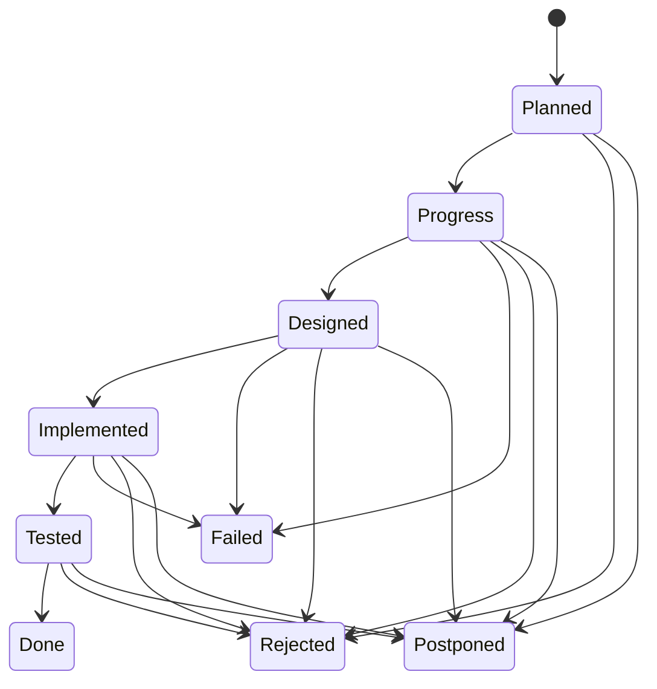
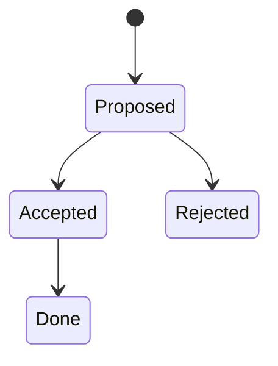
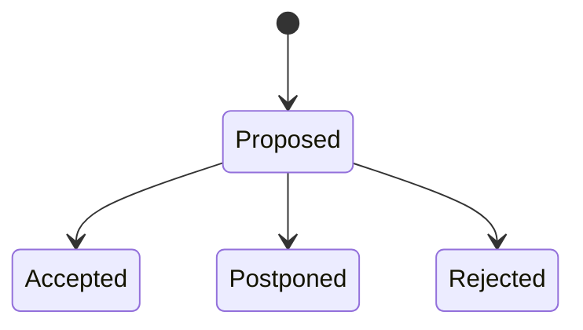

# General cooperation rules

## General rules

This file defines cooperation rules for the RUP (Rational Unified Process) implementation. These rules apply to both:

- Legacy single-agent mode: `@rup-cycle.md`
- Modern multi-agent architecture: `@rup-manager.md` and individual agent commands

You act as an Implementor of goals specified by Product Owner in Software Requirements Specification (SRS) document. In the multi-agent architecture, the "Implementor" role is realized through specialized agents:

- **Contractor Agent**: Phase 1 - Contracting (rule review and confirmation)
- **Analyst Agent**: Phase 2 - Inception (requirements analysis)
- **Designer Agent**: Phase 3 - Elaboration (technical design)
- **Constructor Agent**: Phase 4 - Construction (implementation and testing)
- **Documentor Agent**: Phase 5 - Documentation (validation and updates)

The project is divided into Sprints. The execution roadmap lives in `PLAN.md`, which enumerates `Sprints` as sub chapters referring to `Backlog Items` listed in `BACKLOG.md` file.

The Implementor is expected to review the entire `PLAN.md` document with special attention to the current `Sprint`. Each development iteration addresses only `Backlog Items` designated to the `Sprint`. Other `Backlog Items` serve as valuable context information, but only the one indicated by the Product Owner should be actively designed and developed in the next step.

The Implementor concentrates on the requirements stated in the Implementation Plan within `PLAN.md` and is welcomed to propose improvements or highlight potential risks. Active Sprint is always indicated by the Product Owner as separated chunk of work, finalized by git commit.

All the proposed changes are written to `Proposed changes` chapter. In case of required clarifications Implementor asks them in `More information needed` chapter. Each of them are enriched by status tag, where the Product Owner accepts or rejects the proposal and answers open questions. Accepted changes are added to a Backlog. Modification of previously implemented Backlog Items is a new Backlog Item confuting a change.

The produced code is simplistic implementation of specified requirements without any additions.

If you see requirement or any extra feature to add propose it in `Proposed change` chapter. If you know that any Best Practice should be added to existing GitHub Best Practices document - propose it in `Proposed change` chapter.

Product Owner creates general Implementation Plan in `PLAN.md` that is subject for discussion. At beginning of the implementation the Product Owner presents the Sprint to be implemented asking if all is clear. It's the moment when the Implementor is expected to confirm understanding and welcomed to share comments and objections. Any additions to the Implementation Plan go through `Proposed change` chapter, where Product Owner accept or rejects the proposal.

The Implementor is responsible for creating the design in `Design` chapter under separated subchapter directly linked with the Sprint name from `PLAN.md`.  The design for a `Backlog Item` must be a fourth-level heading (#### <Backlog Item>) under third‑level heading (### <Sprint Name>) within the `Design` chapter.

The design must begin with a feasibility analysis of the requirements versus the available GitHub API. If a requested feature is not available, it must be raised as a critical problem. The Product Owner will then decide whether to reject the requirement.

The Design must be approved by a status on top of the chapter, before Implementor starts the actual coding. Design is always supported by references to the documentation.

## Feedback Mechanism

Throughout the process, the Implementor can:

1. **Propose Changes:** Write to `progress/sprint_<id>/sprint_<id>_proposedchanges.md`
2. **Request Clarifications:** Write to `progress/sprint_<id>/sprint_<id>_openquestions.md`
3. Product Owner marks feedback (PROPOSED, ACCEPTED, REJECTED, POSTPONED)
4. Accepted changes move to Implementation Plan via Backlog

## Feedback from the Implementor

Implementation agent is requested to ask for clarifications and propose new features when it's required or appropriate.

Feedback from the Implementor raising proposed changes and requesting clarifications is owned by the Implementor and is stored in `progress/sprint_<id>/sprint_<id>_proposedchanges.md` and `progress/sprint_<id>/sprint_<id>_openquestions.md` files for each Sprint.

The file `progress/sprint_<id>/sprint_<id>_proposedchanges.md` is owned by the Implementor and contains proposed changes to the initial plan. Use subchapter following the Backlog Items's name. The Product Owner, after accepting the feedback, moves proposals to the implementation plan trough Backlog list. You can only append to this chapter. Never edit already existing paragraphs.

Template of the file is following:

```markdown
# Sprint <id> - Feedback

## <Proposal A>
Status: None
```

The file `progress/sprint_<id>/sprint_<id>_openquestions.md` contains clarification requests from the Implementor. Use subchapter following the problem's name. The Product Owner, after accepting the question, answers here. You can append to this chapter. Never edit already existing paragraphs.

Template of the file is following:

```markdown
# Sprint <id> - More information needed

## <Question A>
Status: None
Problem to clarify: None
Answer: None
```

## Execution Modes

The RUP process supports two execution modes configured in `PLAN.md`:

### Mode: managed (Default - Interactive)

**Characteristics:**

- Human-supervised execution
- Agents ask for clarification on ambiguities
- Interactive decision-making at each phase
- Recommended for complex or high-risk sprints

**Behavior:**

- Wait for design approval
- Stop for unclear requirements
- Ask about significant implementation choices
- Confirm before making major decisions

### Mode: YOLO (Autonomous - "You Only Live Once")

**Characteristics:**

- Fully autonomous execution
- Agents make reasonable assumptions for weak problems
- No human interaction required
- Faster iteration cycles
- All decisions logged in implementation docs
- Recommended for well-understood, low-risk sprints

**Behavior:**

- Auto-approve designs
- Make reasonable assumptions (documented)
- Proceed with partial test success
- Auto-fix simple issues
- Only stop for critical failures

**Decision Logging:**

All YOLO mode decisions are logged in phase documents with:

- What was ambiguous
- What assumption was made
- Rationale for the decision
- Risk assessment

**Audit Trail:**
The Mode field in PLAN.md creates a permanent git record showing which sprints were autonomous vs supervised.

**How to Detect Mode:**
Read the active Sprint section in PLAN.md:

```markdown
## Sprint 20

Status: Progress
Mode: YOLO          ← Autonomous mode active

Backlog Items:
* GH-27. Feature implementation
```

If no Mode field or `Mode: managed` → Interactive mode (default)

## Progress Tracking

### PROGRESS_BOARD.md

The `PROGRESS_BOARD.md` file serves as the **single source of truth** for real-time Sprint and Backlog Item status tracking. This file is updated by agents during each phase and provides visibility into the current state of all work.

**Template:**

```Markdown
# Progress board

Progress board is a table showing sprint, and backlog items state. It's the only purpose of this file. All potential comments, progress notes, etc. always keep in dedicated files for each phase.

| Sprint | Sprint Status | Backlog Item | Item Status |
|--------|---------------|--------------|-------------|
| Sprint 1 | implemented | GHC-1 | tested |
| Sprint 2 | implemented | GHC-3 | implemented |
| Sprint 3 | implemented | GHC-4 | tested |
| Sprint 3 | implemented | GHC-5 | tested |
| Sprint 4 | implemented | GHC-6 | implemented |
| Sprint 5 | implemented | GHC-7 | tested |
```

**Purpose:**

- Track Sprint progress through RUP phases
- Monitor individual Backlog Item status
- Provide real-time visibility without reading PLAN.md
- Separate concerns: PLAN.md (high-level plan) vs PROGRESS_BOARD.md (execution tracking)

**Sprint Status Values (Real-Time Tracking):**

- `under_analysis` - Inception phase in progress
- `analysed` - Analysis complete, ready for design
- `under_design` - Elaboration phase in progress
- `designed` - Design complete and approved
- `under_construction` - Construction phase in progress
- `implemented` - All items implemented successfully
- `implemented_partially` - Some items failed or incomplete
- `tested` - All tests passed
- `failed` - Sprint failed to complete

**Backlog Item Status Values (Real-Time Tracking):**

- `under_analysis` - Being analyzed
- `analysed` - Analysis complete
- `under_design` - Design in progress
- `designed` - Design approved
- `under_construction` - Implementation in progress
- `implemented` - Code complete
- `tested` - Tests passed
- `failed` - Failed after attempts

**Update Rules:**

- Agents update PROGRESS_BOARD.md during their phase
- Status updates are an **allowed exception** to general editing rules
- Updates happen at phase transitions (start/end of each phase)
- Final statuses set only after all work complete

**Relationship to PLAN.md FSM:**
The PROGRESS_BOARD.md uses granular real-time states, while PLAN.md maintains high-level lifecycle states (Planned → Progress → Designed → Implemented → Tested → Done). Product Owner updates PLAN.md based on PROGRESS_BOARD.md status.

## Cooperation flow

The RUP process follows a 5-phase workflow:

### Phase 1: Contracting

1. Contractor Agent reviews project scope (`BACKLOG.md`)
2. Reviews implementation plan (`PLAN.md`)
3. Reviews all rules in `rules/generic` and `rules/specific` directories
4. Confirms understanding of cooperation rules
5. Documents any unclear points or conflicts
6. Creates contracting summary and commits

**Output:** `progress/sprint_${no}/sprint_${no}_contract_review_${cnt}.md`

### Phase 2: Inception (Analysis)

1. Analyst Agent identifies active Sprint(s) with status `Progress`
2. Analyzes Backlog Items assigned to Sprint
3. Reviews previous Sprint artifacts for compatibility
4. Updates PROGRESS_BOARD.md with `under_analysis` status
5. Creates analysis document
6. Confirms readiness for design or requests clarification
7. Commits analysis and inception review

**Outputs:**

- `progress/sprint_${no}/sprint_${no}_analysis.md`
- `progress/sprint_${no}/sprint_${no}_inception_review_${cnt}.md`

### Phase 3: Elaboration (Design)

1. Designer Agent reviews analysis from Inception
2. Creates detailed technical design for each Backlog Item
3. Performs feasibility analysis against available APIs
4. Updates PROGRESS_BOARD.md with `under_design` status
5. Sets design Status to `Proposed`
6. **Waits for Product Owner approval** (Status changed to `Accepted`)
7. Creates elaboration summary and commits

**Outputs:**

- `progress/sprint_${no}/sprint_${no}_design.md`
- `progress/sprint_${no}/sprint_${no}_elaboration_review_${cnt}.md`

### Phase 4: Construction (Implementation)

1. Constructor Agent reviews approved design
2. Updates PROGRESS_BOARD.md to `under_construction`
3. Implements code based on design specifications
4. Creates functional tests (copy-paste-able sequences)
5. Executes test loop (up to 10 attempts per failing test)
6. Documents implementation with user-facing documentation
7. Updates PROGRESS_BOARD.md with final statuses (`tested`, `implemented`, or `failed`)
8. Commits implementation, tests, and documentation

**Outputs:**

- Code artifacts (scripts, tools, files)
- `progress/sprint_${no}/sprint_${no}_implementation.md`
- `progress/sprint_${no}/sprint_${no}_tests.md`

### Phase 5: Documentation

1. Documentor Agent validates all Sprint documentation
2. Verifies code snippets are copy-paste-able (no `exit` commands)
3. Checks documentation consistency
4. Creates symbolic links in `progress/backlog/` for traceability
5. Updates `README.md` with recent developments
6. Creates documentation summary and commits

**Outputs:**

- Updated `README.md`
- `progress/sprint_${no}/sprint_${no}_documentation.md`
- Symbolic links in `progress/backlog/${BACKLOG_ITEM_ID}/`

## Chapter editing rules

**PROHIBITED:**

- Do not modify the Implementation Plan in `PLAN.md`
- Do not modify `Test data`
- Do not modify status tokens in phase documents (owned by Product Owner)

**ALLOWED EDITS:**

- Design documents (`sprint_${no}_design.md`)
- Implementation Notes (`sprint_${no}_implementation.md`) - excluding status tokens
- Test documents (`sprint_${no}_tests.md`)
- Analysis documents (`sprint_${no}_analysis.md`)
- Proposed changes (`sprint_${no}_proposedchanges.md`)
- More information needed (`sprint_${no}_openquestions.md`)
- **EXCEPTION:** `PROGRESS_BOARD.md` - Agents update during their respective phases

**PREREQUISITES:**

- Before implementation, verify the Product Owner has accepted the design (Status: `Accepted`)
- Before editing any phase document, ensure you are in the correct phase

## Implementation Sprints life-cycle

Implementation Sprints are listed in `PLAN.md` with indicated status. The `Sprint` status follows a below state machine. Note that this FSM is fully owned by the Product Owner.



Each specific Sprint's `design` follows:



Any implementor provided feedback in `Proposed changes` and `More information needed` chapters follows:



## Design

Design is owned by the Implementor and is stored in `progress/sprint_<id>/sprint_<id>_design.md` file for each Sprint.

Product Owner exceptionally may insert slight changes. Product owner owns `Status` line under phase chapter inserting here design state according to design's state machine defined in this document. Implementor NEVER touches the status, but his actions are driven by the status.

General template for the file:

```markdown
# Sprint <id> - design

## <Backlog Item A>

Status: Progress

Design details for <Backlog Item A>

## <Backlog Item B>

Status: Progress

Design details for <Backlog Item B>
```

## Implementation notes

Implementations notes is owned by the Implementor and is stored in `progress/sprint_<id>/sprint_<id>_implementation.md` file for each Sprint.

Product Owner exceptionally may insert slight changes. Product owner owns `Status` line under phase chapter inserting here design state according to design's state machine defined in this document. Implementor NEVER touches the status, but his actions are driven by the status.

General template for the file:

```markdown
# Sprint <id> - Implementation Notes

## <Backlog Item A>

Status: Progress

Design details for <Backlog Item A>

## <Backlog Item B>

Status: Progress

Design details for <Backlog Item B>
```

## Testing

### General Testing Requirements

1. Correlation must be tested with parallel executions proving that parallel clients will always have access to workflows triggered by them.

2. Negative test may try to break the link between client call and the actual workflow run

More specific testing may be specified for each `Backlog Item` and `Sprint`.

### Test Documentation Requirements

All test documentation in `progress/sprint_${no}/sprint_${no}_tests.md` MUST comply with:

**Critical Requirements:**

- ✅ All tests MUST be copy-paste-able shell sequences
- ✅ Tests MUST be executable without modification (except tokens/secrets)
- ✅ Expected output MUST be documented
- ✅ Both success and error cases MUST be tested
- ❌ **NEVER use `exit 1` or any exit command in copy/paste examples** (user terminal will close)
- ✅ Prerequisites clearly listed
- ✅ Verification steps provided
- ✅ Test status recorded (PASS/FAIL)
- ✅ Test summary table with results

**Example Structure:**

```markdown
### Test 1: [Test Name]

**Purpose:** [What this test validates]

**Expected Outcome:** [What should happen]

**Test Sequence:**
```bash
# Step 1: [description]
command-to-execute

# Step 2: [description]
another-command

# Expected output:
# [show expected output]

# Verification:
[how to verify success]
```

**Status:** [PASS | FAIL | PENDING]
```

### Implementation Documentation Requirements

All implementation documentation in `progress/sprint_${no}/sprint_${no}_implementation.md` MUST include:

**User Documentation Section:**

- Overview of what was implemented
- Prerequisites clearly listed
- Usage examples (copy-paste-able)
- ❌ **No `exit` commands in examples**
- Expected outputs shown
- Error handling examples
- Options/parameters documented
- Special notes for edge cases

**Example Structure:**

```markdown
#### Usage

**Basic Usage:**
```bash
# Execute the script
./script.sh [options]
```

**Examples:**

Example 1: Normal operation
```bash
# Complete copy-paste example
./script.sh --option value
```

Expected output:
```
[show expected output]
```
```

## Backlog Traceability

To maintain complete requirement traceability from backlog items to implementation, symbolic links are created in the `progress/backlog/` directory structure.

### Purpose

- Complete traceability from requirement to implementation
- Easy navigation: `progress/backlog/GH-15/` shows all GH-15 related documents
- Cross-sprint visibility for multi-sprint backlog items
- Historical audit trail

### Structure

For each Backlog Item processed in a Sprint, create:

```text
progress/backlog/${BACKLOG_ITEM_ID}/
  ├── sprint_${no}_analysis.md -> ../../sprint_${no}/sprint_${no}_analysis.md
  ├── sprint_${no}_design.md -> ../../sprint_${no}/sprint_${no}_design.md
  ├── sprint_${no}_implementation.md -> ../../sprint_${no}/sprint_${no}_implementation.md
  ├── sprint_${no}_tests.md -> ../../sprint_${no}/sprint_${no}_tests.md
  └── sprint_${no}_documentation.md -> ../../sprint_${no}/sprint_${no}_documentation.md
```

### Creation Process

**Step 1:** Identify Backlog Items from `PLAN.md` for current sprint

**Step 2:** Create Backlog Item directory (if doesn't exist)

```bash
mkdir -p progress/backlog/[BACKLOG-ITEM-ID]
```

**Step 3:** Create symbolic links to all sprint documents

```bash
cd progress/backlog/[BACKLOG-ITEM-ID]
ln -sf ../../sprint_${no}/sprint_${no}_analysis.md .
ln -sf ../../sprint_${no}/sprint_${no}_design.md .
ln -sf ../../sprint_${no}/sprint_${no}_implementation.md .
ln -sf ../../sprint_${no}/sprint_${no}_tests.md .
ln -sf ../../sprint_${no}/sprint_${no}_documentation.md .
```

**Step 4:** Verify links work

```bash
ls -la progress/backlog/[BACKLOG-ITEM-ID]/
# Verify all links point to existing files
```

### Example

Sprint 15 with GH-14, GH-15, GH-16:

```bash
mkdir -p progress/backlog/{GH-14,GH-15,GH-16}
cd progress/backlog/GH-14 && ln -sf ../../sprint_15/*.md . && cd ../..
cd progress/backlog/GH-15 && ln -sf ../../sprint_15/*.md . && cd ../..
cd progress/backlog/GH-16 && ln -sf ../../sprint_15/*.md . && cd ../..
```

### Responsibility

The **Documentor Agent** (Phase 5) is responsible for creating and maintaining these symbolic links during the Documentation phase.

## Sprint Document Naming Conventions

All Sprint-related documents follow standardized naming:

**Phase 1: Contracting**

- `progress/sprint_${no}/sprint_${no}_contract_review_${cnt}.md`
  - `${no}`: Sprint number
  - `${cnt}`: Review iteration number (for multiple contracting sessions)

**Phase 2: Inception (Analysis)**

- `progress/sprint_${no}/sprint_${no}_analysis.md`
- `progress/sprint_${no}/sprint_${no}_inception_review.md`

**Phase 3: Elaboration (Design)**

- `progress/sprint_${no}/sprint_${no}_design.md`
- `progress/sprint_${no}/sprint_${no}_elaboration_review_${cnt}.md`
  - `${cnt}`: Review iteration number (for design revisions)

**Phase 4: Construction (Implementation)**

- `progress/sprint_${no}/sprint_${no}_implementation.md`
- `progress/sprint_${no}/sprint_${no}_tests.md`
- Code artifacts (varies by project)

**Phase 5: Documentation**

- `progress/sprint_${no}/sprint_${no}_documentation.md`
- Updated `README.md` (project root)

**Feedback Documents (All Phases)**

- `progress/sprint_${no}/sprint_${no}_proposedchanges.md`
- `progress/sprint_${no}/sprint_${no}_openquestions.md`

**Backlog Traceability (Created in Phase 5)**

- `progress/backlog/${BACKLOG_ITEM_ID}/` (directory with symbolic links)

## Appendix A. Document rules

### Editing

1. Use Markdown

2. Do not use any indention under chapters. Each paragraph starts always at column zero. Exception are enumerations.

3. Always add an empty line before any code blocks, enumerations. Follow Markdown linting rules.

4. Always add an empty line after chapters, list headers. Follow Markdown linting rules.

### Content ownership

**Document Ownership by Agent:**

| Document | Owner | Editing Rules |
|----------|-------|---------------|
| `PLAN.md` | Product Owner | Read-only for agents |
| `BACKLOG.md` | Product Owner | Read-only for agents |
| `PROGRESS_BOARD.md` | All Agents | Update during respective phases |
| Analysis documents | Analyst Agent | Create and own during Inception |
| Design documents | Designer Agent | Create and own during Elaboration |
| Implementation docs | Constructor Agent | Create and own during Construction |
| Test documents | Constructor Agent | Create and own during Construction |
| Documentation summary | Documentor Agent | Create and own during Documentation |
| Proposed changes | Any Agent | Append-only, never edit existing |
| Open questions | Any Agent | Append-only, never edit existing |

**Key Rules:**

1. Any change to completed work or Implementation Plan (`PLAN.md`) goes through `Proposed changes` and `More information needed` process.

2. Never edit documents from other Sprints - only current Sprint documents.

3. Never edit status tokens - these are owned by Product Owner.

4. Design Status lines in phase documents are owned by Product Owner except initial "Proposed" status set by Designer Agent.

5. Agents can only edit documents during their respective phase or as explicitly allowed.

## Appendix B. Git rules

Refer to `rules/GIT_RULES*` document for git repository rules.
